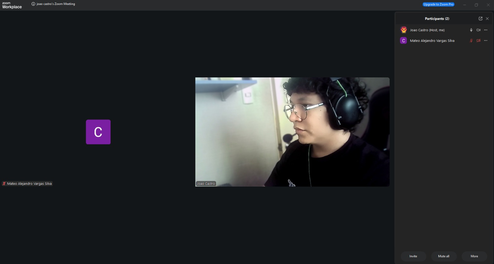
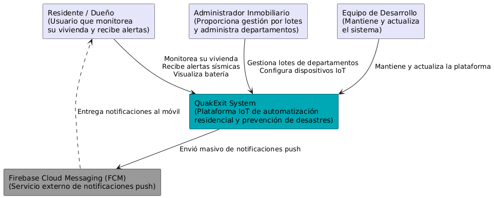
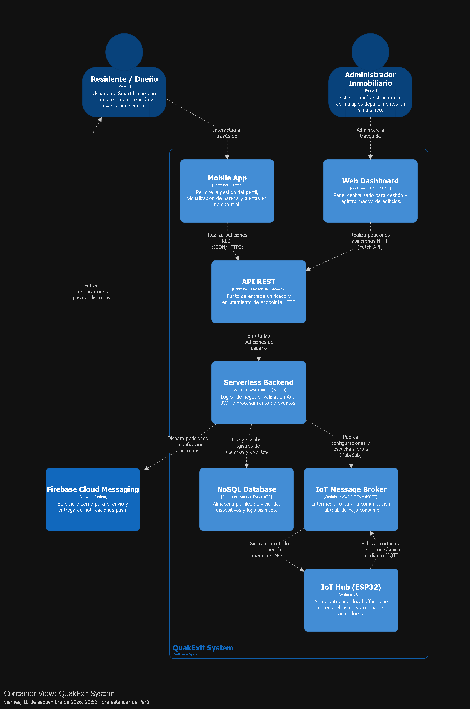
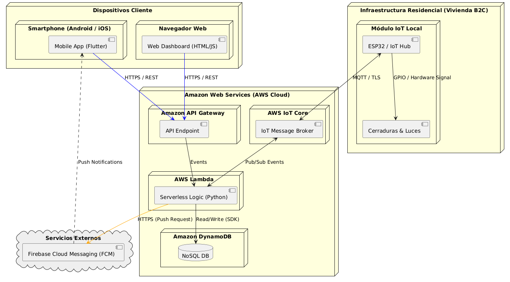

# Informe del Trabajo Final

  

  
Universidad Peruana de Ciencias Aplicadas

  
Facultad de Ingeniería

  
Carrera: Ingeniería de Software

  
<b>Periodo: 202620 </b>

  
Código del curso: 1ASI0572 

    
Nombre del curso: Desarrollo de Soluciones IOT

  
NRC: 8729

  
Nombre del profesor: Marco Antonio Leon Baca

  
<b>Informe de Primer Avance</b>

  
Nombre del startup: TerraGuard

  
Nombre del producto: QuakExit

---

<h3 align="center">Relación de integrantes</h3>

<table>
  <thead>
    <tr>
      <th>Código</th>
      <th>Apellidos y Nombres</th>
    </tr>
  </thead>
  <tbody>
    <tr>
      <td>U20231G159</td>
      <td>Castro Picón, Manuel Fernando Joao</td>
    </tr>
    <tr>
      <td>U20321774</td>
      <td>Requena Gutiérrez, Diego Gabriel</td>
    </tr>
    <tr>
      <td>U202213406</td>
      <td>Quiroz Zambrano, Fabrizio Javier</td>
    </tr>
    <tr>
      <td>U20231B475</td>
      <td>Solis Chang, Santiago Valentino</td>
    </tr>
    <tr>
      <td>U20231G054</td>
      <td>Vila Guillen, Miguel Angel</td>
    </tr>
    <tr>
      <td>U202213553</td>
      <td>De Las Casas Latour, Sebastián</td>
    </tr>
    <tr>
      <td>U202310129</td>
      <td>Navarro Correa, Cesar Augusto</td>
    </tr>
  </tbody>
</table>

<b>Tabla 0.1.</b> Relación de integrantes del equipo.

  
  
<b>Septiembre, 2026</b>

---

## Project Report Collaboration Insights

## Registro de Versiones del Informe

El objetivo de esta sección es resumir las modificaciones relevantes que se realizan al informe durante el ciclo de vida del proyecto.

| Versión | Fecha      | Autor(es)                                           | Descripción de modificación                                                                                                                                   |
| :------ | :--------- | :-------------------------------------------------- | :------------------------------------------------------------------------------------------------------------------------------------------------------------ |
| 1.0     | 2026-09-10 | Manuel Castro                                       | Creación inicial del documento: carátula, perfiles del equipo (Startup Profile) y estructura base del Student Outcome (AV1).                                  |
| 1.1     | 2026-09-12 | Diego Requena & Manuel Castro                       | Se añadió el Solution Profile (Antecedentes del riesgo sísmico, Lean UX Problem Statements, Assumptions e Hypothesis) y Segmentos Objetivo.                   |
| 1.2     | 2026-09-14 | Santiago Solis & Miguel Vila                        | Se incorporó el análisis competitivo (SISMATE, SASSLA, ShakeAlert) y el registro y análisis de entrevistas (dueños de Smart Homes e Inmobiliarias).           |
| 1.3     | 2026-09-15 | Manuel Castro & Diego Requena                       | Inclusión de la sección Needfinding (User Personas, Task Matrix, Journey Mapping, Empathy Mapping y As-is Scenario Mapping).                                  |
| 1.4     | 2026-09-16 | Santiago Solis & Miguel Vila                        | Definición del Lenguaje Ubicuo, redacción de User Stories (7 Épicas), estructuración del Impact Mapping y consolidación del Product Backlog.                  |
| 1.5     | 2026-09-17 | Manuel Castro & Santiago Solis                      | Inicio del Capítulo IV: Desarrollo del Strategic-Level DDD, Design-Level EventStorming, Candidate Context Discovery y Bounded Context Canvases.               |
| 1.6     | 2026-09-18 | Miguel Vila & Diego Requena                         | Elaboración de la Arquitectura de Software bajo el Modelo C4, incluyendo los diagramas System Landscape, Context, Container y Deployment.                     |
| 1.7     | 2026-09-19 | Sebastián De Las Casas, César Navarro & Fabrizio Quiroz | Inclusión del Tactical-Level DDD, definición de capas de dominio/aplicación, diagramas de clases UML y diseño de base de datos para los Bounded Contexts. |

# Contenido

- [Project Report Collaboration Insights](#project-report-collaboration-insights)
- [Registro de Versiones del Informe](#registro-de-versiones-del-informe)
- [Contenido](#contenido)
- [Student Outcome](#student-outcome)
- [Capítulo I: Introducción](#capítulo-i-introducción)
  - [1.1. Startup Profile](#11-startup-profile)
    - [1.1.1. Descripción de la Startup](#111-descripción-de-la-startup)
    - [1.1.2. Perfiles de integrantes del equipo](#112-perfiles-de-integrantes-del-equipo)
  - [1.2. Solution Profile](#12-solution-profile)
    - [1.2.1. Antecedentes y problemática](#121-antecedentes-y-problemática)
    - [1.2.2. Lean UX Process](#122-lean-ux-process)
      - [1.2.2.1. Lean UX Problem Statements](#1221-lean-ux-problem-statements)
      - [1.2.2.2. Lean UX Assumptions](#1222-lean-ux-assumptions)
      - [1.2.2.3. Lean UX Hypothesis Statements](#1223-lean-ux-hypothesis-statements)
      - [1.2.2.4. Lean UX Canvas](#1224-lean-ux-canvas)
  - [1.3. Segmentos objetivo](#13-segmentos-objetivo)
- [Capítulo II: Requirements Elicitation & Analysis](#capítulo-ii-requirements-elicitation--analysis)
  - [2.1. Competidores](#21-competidores)
    - [2.1.1. Análisis competitivo](#211-análisis-competitivo)
    - [2.1.2. Estrategias y tácticas frente a competidores](#212-estrategias-y-tácticas-frente-a-competidores)
  - [2.2. Entrevistas](#22-entrevistas)
    - [2.2.1. Diseño de entrevistas](#221-diseño-de-entrevistas)
    - [2.2.2. Registro de entrevistas](#222-registro-de-entrevistas)
    - [2.2.3. Análisis de entrevistas](#223-análisis-de-entrevistas)
  - [2.3. Needfinding](#23-needfinding)
    - [2.3.1. User Personas](#231-user-personas)
    - [2.3.2. User Task Matrix](#232-user-task-matrix)
    - [2.3.3. User Journey Mapping](#233-user-journey-mapping)
    - [2.3.4. Empathy Mapping](#234-empathy-mapping)
  - [2.4. Big Picture EventStorming](#24-big-picture-eventstorming)
  - [2.5. Ubiquitous Language](#25-ubiquitous-language)
- [Capítulo III: Requirements Specification](#capítulo-iii-requirements-specification)
  - [3.1. User Stories](#31-user-stories)
  - [3.2. Impact Mapping](#32-impact-mapping)
  - [3.3. Product Backlog](#33-product-backlog)
- [Capítulo IV: Solution Software Design](#capítulo-iv-solution-software-design)
  - [4.1. Strategic-Level Domain-Driven Design](#41-strategic-level-domain-driven-design)
    - [4.1.1. Design-Level EventStorming](#411-design-level-eventstorming)
      - [4.1.1.1. Candidate Context Discovery](#4111-candidate-context-discovery)
      - [4.1.1.2. Domain Message Flows Modeling](#4112-domain-message-flows-modeling)
      - [4.1.1.3. Bounded Context Canvases](#4113-bounded-context-canvases)
    - [4.1.2. Context Mapping](#412-context-mapping)
    - [4.1.3. Software Architecture](#413-software-architecture)
      - [4.1.3.1. Software Architecture System Landscape Diagram](#4131-software-architecture-system-landscape-diagram)
      - [4.1.3.2. Software Architecture Context Level Diagrams](#4132-software-architecture-context-level-diagrams)
      - [4.1.3.3. Software Architecture Container Level Diagrams](#4133-software-architecture-container-level-diagrams)
      - [4.1.3.4. Software Architecture Deployment Diagrams](#4134-software-architecture-deployment-diagrams)
  - [4.2. Tactical-Level Domain-Driven Design](#42-tactical-level-domain-driven-design)
    - [4.2.1. Bounded Context: <Nombre>](#421-bounded-context-nombre)
      - [4.2.1.1. Domain Layer](#4211-domain-layer)
      - [4.2.1.2. Interface Layer](#4212-interface-layer)
      - [4.2.1.3. Application Layer](#4213-application-layer)
      - [4.2.1.4. Infrastructure Layer](#4214-infrastructure-layer)
      - [4.2.1.5. Bounded Context Software Architecture Component Level Diagrams](#4215-bounded-context-software-architecture-component-level-diagrams)
      - [4.2.1.6. Bounded Context Software Architecture Code Level Diagrams](#4216-bounded-context-software-architecture-code-level-diagrams)
        - [4.2.1.6.1. Bounded Context Domain Layer Class Diagrams](#42161-bounded-context-domain-layer-class-diagrams)
        - [4.2.1.6.2. Bounded Context Database Design Diagram](#42162-bounded-context-database-design-diagram)
- [Conclusiones](#conclusiones)
- [Bibliografía](#bibliografía)
- [Anexos](#anexos)

## Student Outcome

El curso contribuye al cumplimiento del Student Outcome ABET:
**ABET – EAC - Student Outcome 5**
**Criterio:** La capacidad de funcionar efectivamente en un equipo cuyos miembros juntos proporcionan liderazgo, crean un entorno de colaboración e inclusivo, establecen objetivos, planifican tareas y cumplen objetivos.

En el siguiente cuadro se describen las acciones realizadas y los enunciados de conclusiones por parte del grupo, que permiten sustentar el haber alcanzado el logro del ABET – EAC - Student Outcome 5 para el primer avance (AV1).

| Criterio específico | Acciones realizadas | Conclusiones |
| :--- | :--- | :--- |
| **Trabaja en equipo para proporcionar liderazgo en forma conjunta** | **Castro Picón, Manuel Fernando Joao** **AV1:** • Lideró la definición de la estrategia del negocio y facilitó las sesiones colaborativas de EventStorming.  **Solis Chang, Santiago Valentino** **AV1:** • Asumió el liderazgo en la delimitación de los Bounded Contexts y la elaboración estructural de los Canvases.  **Vila Guillen, Miguel Angel** **AV1:** • Dirigió el análisis arquitectónico a nivel macro, estableciendo los lineamientos y diagramas principales del modelo C4.  **Requena Gutiérrez, Diego Gabriel** **AV1:** • Tomó la iniciativa en la definición de la infraestructura técnica, los proveedores cloud y los diagramas de despliegue.  **De Las Casas Latour, Sebastián** **AV1:** • Lideró la estructuración táctica (DDD), organizando las responsabilidades de las capas internas (Dominio, Aplicación e Infraestructura).  **Navarro Correa, César Augusto** **AV1:** • Guió el modelado de entidades y repositorios, liderando el diseño de los diagramas de clases UML del sistema.  **Quiroz Zambrano, Fabrizio Javier** **AV1:** • Asumió el control del diseño de la persistencia de datos y la estructuración técnica de los diagramas Entidad-Relación. | **AV1:** Durante el primer avance, el equipo logró distribuir el liderazgo de forma equitativa. Se delegó la dirección de tareas específicas basándose en las fortalezas técnicas de cada integrante (estrategia, arquitectura general y diseño táctico), lo que permitió un avance sostenido, especializado y un liderazgo verdaderamente compartido. |
| **Crea un entorno colaborativo e inclusivo, establece metas, planifica tareas y cumple objetivos.** | **Castro Picón, Manuel Fernando Joao** **AV1:** • Planificó las tareas de investigación iniciales (Lean UX) y fomentó la participación equitativa en la definición de la problemática.  **Solis Chang, Santiago Valentino** **AV1:** • Colaboró en la redacción de requerimientos y organizó las sesiones de priorización para completar el Product Backlog a tiempo.  **Vila Guillen, Miguel Angel** **AV1:** • Integró las ideas del equipo para el análisis competitivo y aseguró el cumplimiento del cronograma en el diseño de arquitectura.  **Requena Gutiérrez, Diego Gabriel** **AV1:** • Estableció los objetivos de validación inicial y coordinó la recopilación y análisis conjunto de las entrevistas a los segmentos objetivo.  **De Las Casas Latour, Sebastián** **AV1:** • Creó un ambiente de apoyo para el subgrupo de diseño táctico, asegurando la entrega oportuna y articulada de los componentes de software.  **Navarro Correa, César Augusto** **AV1:** • Coordinó de manera inclusiva la integración de sus diagramas de clases con los requerimientos estratégicos planteados por el resto del equipo.  **Quiroz Zambrano, Fabrizio Javier** **AV1:** • Cumplió puntualmente con los objetivos de diseño de base de datos, manteniendo una comunicación constante y asertiva con los encargados de la arquitectura macro. | **AV1:** El equipo consolidó un entorno de trabajo colaborativo mediante la división estratégica del trabajo en tres subgrupos principales. Se cumplieron todos los objetivos trazados para el AV1 respetando los cronogramas internos, asegurando que las decisiones de diseño arquitectónico fueran discutidas, consensuadas y aprobadas por los 7 integrantes del proyecto. |

# Capítulo I: Introducción

## 1.1 Startup Profile

### 1.1.1. Descripción de la Startup

TerraGuard es una startup tecnológica emergente dedicada al diseño y desarrollo de soluciones integrales que fusionan el Internet de las Cosas (IoT) con el desarrollo de software orientado a la seguridad residencial. La empresa nace con el propósito de mitigar la vulnerabilidad de las personas frente a desastres naturales, específicamente eventos sísmicos, democratizando el acceso a sistemas de automatización que protegen la vida humana.

### 1.1.2. Perfiles de integrantes del equipo

| Foto                                              | Nombres y Apellidos               | Carrera                | Descripción                                                                                                                                                                                                                                                                                                            |
|---------------------------------------------------|-----------------------------------| ---------------------- |------------------------------------------------------------------------------------------------------------------------------------------------------------------------------------------------------------------------------------------------------------------------------------------------------------------------|
|         | Manuel Fernando Joao Castro Picón | Ingeniería de Software | Tengo 20 años y curso el 7mo ciclo en la Universidad Peruana de Ciencias Aplicadas. Me gusta entrenar calistenia, escuchar música y jugar fútbol. Me considero responsable, adaptable al trabajo en equipo y con metas claras para ser un gran profesional.                                                            |
|   | Santiago Valentino Solis Chang    | Ingeniería de Software | Tengo 21 años y curso el 7mo ciclo en la Universidad Peruana de Ciencias Aplicadas. En mi tiempo libre disfruto jugar videojuegos, practicar tenis y aprender sobre programación web. Soy responsable, comprometido y capaz de trabajar en equipo.                                                                     |
|           | Miguel Angel Vila Guillen         | Ingeniería de Software | Tengo 21 años y estudio el 6to ciclo en la Universidad Peruana de Ciencias Aplicadas. Me gusta jugar videojuegos, tocar la guitarra y el fútbol. Me considero capaz de trabajar en equipo y aspiro a ser un profesional competente.                                                                                    |
|  | Diego Gabriel Requena Gutiérrez   | Ingeniería de Software | Tengo 19 años y curso el 5to ciclo en la Universidad Peruana de Ciencias Aplicadas. Soy una persona comprometida con mis objetivos, busco optimizar mi rendimiento y mantener un equilibrio entre la excelencia y una vida saludable.                                                                                  |
|   | Sebastián De Las Casas Latour     | Ingeniería de Software | Tengo 22 años y curso el 8vo ciclo en la Universidad Peruana de Ciencias Aplicadas. Busco desarrollar mis competencias en análisis, diseño y construcción de soluciones de software, aplicando los conocimientos adquiridos durante mi formación académica.                                                            |
|           | César Augusto Navarro Correa      | Ingeniería de Software | Mi nombre es Cesar Navarro, tengo 19 años y soy de la carrera de Ingeniería de Software de la UPC. Me considero una persona creativa en la realización de los trabajos y resiliente en mis actividades. Tengo conocimientos de lenguajes de programación en C++ y Python, pues siempre tuve interés en la computación. |
|        | Fabrizio Javier Quiroz Zambrano   | Ingeniería de Software | Mi nombre es Fabrizio, tengo 21 años y me interesa todo lo que tenga que ver con conmputacion. Trabajo bien en grupo y siempre trato de aprender mas.                                                                                                                                                                  |

## 1.2. Solution Profile

### 1.2.1. Antecedentes y problemática

El Perú se encuentra ubicado en el denominado Cinturón de Fuego del Pacífico, una de las zonas con mayor actividad telúrica del mundo. Específicamente para la ciudad de Lima y Callao, el Instituto Geofísico del Perú (IGP) y el Instituto Nacional de Defensa Civil (INDECI) han advertido sobre un "silencio sísmico" de aproximadamente 300 años en la costa central. Esta acumulación prolongada de energía proyecta la ocurrencia inminente de un terremoto de magnitud 8.8.

Según estimaciones recientes de INDECI, un evento de esta naturaleza afectaría a cerca de 7 millones de personas. El riesgo se agrava al considerar que, según expertos, aproximadamente el 70% de las viviendas en Lima presentan altos niveles de vulnerabilidad estructural debido a la autoconstrucción, uso de suelos inestables y falta de supervisión técnica. En este contexto de inminente riesgo estructural, la capacidad de evacuación inmediata en los primeros segundos del sismo es el factor determinante para preservar la vida de los ocupantes.

Las actuales alertas tempranas de sismos (como el sistema SISMATE o sensores sísmicos convencionales) cumplen un rol exclusivamente informativo. No están vinculadas a un ecosistema de respuesta física (Internet of Things) que accione mecanismos de salvaguarda, como el desbloqueo automático de chapas electromagnéticas o el encendido de señalización de emergencia.

Esta desconexión entre la alerta y la acción física obliga al usuario a depender de su propia respuesta manual bajo condiciones de visibilidad nula y estrés extremo, convirtiendo el propio sistema de seguridad anti-robos de la vivienda en una trampa mortal durante un desastre natural.

### 1.2.2. Lean UX Process

#### 1.2.2.1. Lean UX Problem Statements

**Problem Statement 1: Enfoque en el usuario final (Dueños de Smart Homes)**

El mercado actual de dispositivos para Smart Homes se centra principalmente en el confort (iluminación, entretenimiento) y la seguridad anti-robos. Sin embargo, hemos observado que los usuarios residenciales carecen de automatización frente a desastres naturales. Durante un sismo de gran magnitud, los propios sistemas de seguridad de la vivienda (cerraduras mecánicas o electrónicas sin protocolo de emergencia) se convierten en obstáculos. Esto causa pánico, desorientación en la oscuridad y retrasos críticos en la evacuación debido a la búsqueda de llaves manuales. ¿Cómo podemos integrar un protocolo de emergencia IoT en los hogares inteligentes que reaccione instantáneamente ante la actividad sísmica, automatizando el desbloqueo de vías de escape y guiando al usuario hacia un entorno seguro de forma autónoma?

**Problem Statement 2: Enfoque empresarial (Inmobiliarias y Constructoras)**

Las inmobiliarias desarrollan edificios multifamiliares modernos buscando ofrecer ventajas competitivas basadas en tecnología y seguridad. Actualmente, los protocolos de emergencia estructurales se limitan a las áreas comunes (alarmas contra incendios, rociadores), pero no se integran con los accesos privados de cada departamento. Esto genera cuellos de botella severos, ya que la evacuación depende de que cada residente logre destrabar su puerta manualmente bajo estrés. ¿Cómo podemos ofrecer a las inmobiliarias una solución IoT escalable e integrable desde la construcción que garantice el desbloqueo simultáneo y coordinado de las rutas de evacuación en todo el edificio durante un sismo, agregando valor comercial a sus proyectos inmobiliarios?

#### 1.2.2.2. Lean UX Assumptions

**Business Assumptions (Suposiciones de Negocio)**

- Creemos que los dueños de Smart Homes preferirán adquirir QuakExit mediante un modelo de pago único que cubra el dispositivo y la instalación, en lugar de un modelo de suscripción mensual recurrente.
- Creemos que las empresas inmobiliarias y constructoras percibirán un alto valor comercial en integrar la tecnología de QuakExit desde la fase de construcción para ofrecer departamentos con "seguridad sísmica inteligente" como ventaja competitiva.
- Creemos que nuestro mercado objetivo inicial se encuentra en distritos de alta urbanización vertical en Lima (ej. Santiago de Surco), donde existe una mayor adopción tecnológica y preocupación por la seguridad en edificios.

**User Assumptions (Suposiciones del Usuario)**

- Asumimos que el usuario priorizará su evacuación inmediata sobre el riesgo de intrusión física durante un evento sísmico de gran magnitud (es decir, aceptan que la puerta se desbloquee para poder huir).
- Asumimos que los usuarios desconfiarían de un sistema que dependa puramente de la red eléctrica comercial, por lo que requerirán evidencia de que el dispositivo cuenta con autonomía energética (batería de respaldo) para sentirse seguros.
- Asumimos que el usuario principal en un entorno B2C(negocio a consumidor) tiene conocimientos básicos de uso de aplicaciones móviles para recibir notificaciones y gestionar el estado del dispositivo.

**Technical Assumptions (Suposiciones Técnicas)**

- Asumimos que las infraestructuras de red convencionales (Wi-Fi/Datos móviles) colapsarán durante el sismo, por lo que la acción crítica (el desbloqueo de cerraduras y activación de alarmas locales) debe ejecutarse mediante Edge Computing, operando de forma 100% offline en el microcontrolador.
- Asumimos que el hardware puede mantenerse operando bajo un esquema de eficiencia energética (modos Deep Sleep) para prolongar la vida útil de la batería de respaldo sin comprometer la sensibilidad de detección.
- Asumimos que para el MVP (maqueta universitaria), podremos simular estos escenarios críticos utilizando un microcontrolador (ej. ESP32/Arduino) y actuadores básicos (servomotores o relés para chapas electromagnéticas) que representen las puertas de la vivienda.

#### 1.2.2.3. Lean UX Hypothesis Statements

**Hypothesis Statement 01: Latencia de Evacuación**

**Creemos** que facilitaremos la evacuación inmediata y reduciremos el pánico de los usuarios si automatizamos el desbloqueo de las vías de escape. Lo **sabremos** **cuando** las pruebas de estrés en nuestra maqueta funcional demuestren que el microcontrolador y el actuador logran abrir la puerta en un tiempo menor a 5 segundos tras la activación del modo de emergencia.

**Hypothesis Statement 02: Resiliencia del Sistema**

**Creemos** que generaremos total confianza en la fiabilidad del sistema si garantizamos su funcionamiento ante los cortes de servicios básicos que ocurren durante un sismo. **Lo sabremos** **cuando** el 100% de las pruebas de activación en la maqueta resulten exitosas simulando una desconexión total de la red Wi-Fi y operando exclusivamente con la batería de respaldo.

**Hypothesis Statement 03: Alertas y Notificaciones**

**Creemos** que el usuario percibirá un alto valor de seguridad si está informado en tiempo real sobre el estado de su vivienda, incluso si no se encuentra en ella. **Lo sabremos cuando** el sistema logre enviar la notificación de "Modo Emergencia Activado" al celular del usuario inmediatamente después de procesar la detección del sismo (siempre que la red de internet siga disponible en los primeros segundos del evento).

**Hypothesis Statement 04: Aceptación de Mercado**

**Creemos** que el mercado residencial e inmobiliario está dispuesto a invertir en prevención automatizada. **Lo sabremos cuando** alcancemos las siguientes métricas en nuestras entrevistas de validación:

- Al menos 8 de cada 10 personas (80%) afirmen estar dispuestos a adquirir e instalar la solución en sus hogares.

- Obtengamos una respuesta positiva o intención de compra teórica por parte de representantes de al menos una firma inmobiliaria.

**Hypothesis Statement 05: Eficiencia Energética**

**Creemos** que el dispositivo será viable para su implementación a largo plazo si no requiere intervención constante del usuario para cargar su batería. **Lo sabremos cuando** demostremos mediante cálculos técnicos que el uso de modos de bajo consumo (Deep Sleep) en el microcontrolador permite una autonomía prolongada utilizando únicamente el módulo de energía de respaldo.

#### 1.2.2.4. Lean UX Canvas

Lean UX Canvas es una de las herramientas que hemos utilizado para comprender a nuestros posibles usuarios y sus necesidades. Esta es usada en el campo del diseño centrado en el usuario y la metodología Lean con la intención de desarrollar productos de forma eficientes y práctica para los usuarios. A su vez, esta puede ser utilizada por equipos multidisciplinarios para que colaboración de forma ordenada dentro un marco estructurado.

  

## 1.3. Segmentos objetivo

#### Segmento objetivo #1: Dueños de Smart Homes

Este segmento representa a los usuarios que adquirirán el sistema de forma individual para implementarlo en sus viviendas actuales. Hombres y mujeres de 30 a 55 años de edad, pertenecientes a los niveles socioeconómicos A y B. Generalmente son propietarios de la vivienda o arrendatarios de largo plazo, muchos de ellos con familias constituidas a su cargo. Tienen un perfil tecnológico en el cual no tienen miedo de incorporar nuevas tecnologías si estas demuestran mejorar su calidad de vida o brindarles tranquilidad.

#### Segmento objetivo #2: Inmobiliarias y Constructores

Este segmento permite la escalabilidad del proyecto al integrar el hardware de QuakExit directamente en los planos eléctricos de nuevos proyectos multifamiliares. Son empresas competitivas que buscan constantemente factores diferenciadores que aumenten el valor por metro cuadrado de sus departamentos y aceleren el proceso de venta. Compran tecnología por volumen (Economía de Escala). Buscan proveedores tecnológicos que ofrezcan integración sencilla desde la fase de construcción y que cumplan con las normativas de seguridad de INDECI. Les interesa ofrecer a sus clientes finales un concepto de "Seguridad Sísmica Inteligente" lista para usar desde la entrega de llaves.

---

# Capítulo II: Requirements Elicitation & Analysis

## 2.1. Competidores

En este apartado analizaremos las posibles competencias para **QuakExit**, evaluando sus características clave, sus diferencias respecto a nuestra propuesta de valor de automatización IoT y sus limitaciones operativas durante un evento sísmico.

| Competidores                                                                            | Características                                                                                                                                                                                                                                                                     | Diferencias                                                                                                                                                                                        | Limitaciones                                                                                                                                                                                                                                |
| --------------------------------------------------------------------------------------- | ----------------------------------------------------------------------------------------------------------------------------------------------------------------------------------------------------------------------------------------------------------------------------------- | -------------------------------------------------------------------------------------------------------------------------------------------------------------------------------------------------- | ------------------------------------------------------------------------------------------------------------------------------------------------------------------------------------------------------------------------------------------- |
| **[SISMATE](https://www.gob.pe/institucion/mtc/colecciones/532)** (Perú - INDECI / MTC) | - Sistema oficial del Estado peruano que difunde alertas masivas mediante tecnología Cell Broadcast en teléfonos móviles. - Alerta temprana a nivel poblacional ante emergencias y desastres naturales. - Cobertura masiva y de uso público.                                  | - Enfoque estrictamente informativo e institucional. - No se conecta con los dispositivos físicos o la infraestructura interna del hogar. - Notifica a la población pero no acciona salidas. | - No resuelve el bloqueo físico de puertas ni la falta de luz en el inmueble. - Genera alerta sonora pero deja al ciudadano a cargo de la evacuación manual. - Dependencia de la infraestructura de telecomunicaciones pública.       |
| **[SASSLA](https://www.sassla.mx/)** (México - Sistema de Alerta Temprana)              | - App móvil de alerta sísmica en tiempo real basada en el Sistema de Alerta Sísmica Mexicano (SASMEX). - Notifica con aviso sonoro prioritario que interrumpe el teléfono incluso en modo "no molestar". - Muestra el tiempo estimado de llegada (ETA) y mapas de intensidad. | - Plataforma digital especializada en la interacción smartphone-usuario. - Integración enfocada en la pantalla y altavoz del celular.                                                           | - Limitado al ámbito digital e informativo. - No acciona mecanismos físicos de salvaguarda (cerraduras electromagnéticas o lucerías de emergencia). - Inútil si el celular está lejos o si el usuario entra en pánico sin reaccionar. |
| **[ShakeAlert](https://www.shakealert.org/)** (EE. UU. - USGS)                          | - Sistema de alerta temprana para la costa oeste de EE. UU. administrado por el USGS. - Emite señales para celulares e integra automatización con infraestructuras críticas (transporte, hospitales, bomberos).                                                                  | - Dispone de algoritmos con capacidad de integración industrial e institucional a gran escala. - Red de acelerómetros profesionales e infraestructura pública masiva.                           | - Solución orientada a la macro-infraestructura pública y empresarial. - Costos de implementación inaccesibles para el sector residencial masivo. - No comercializa un kit de domótica doméstico accesible para viviendas familiares. |

---

### 2.1.1. Análisis competitivo

| Criterio                                          | SISMATE / SASPe (Perú)                                                                                                                                         | SASSLA (México)                                                                                                                                           | ShakeAlert (EE. UU.)                                                                                                                                              |
| :------------------------------------------------ | :------------------------------------------------------------------------------------------------------------------------------------------------------------- | :-------------------------------------------------------------------------------------------------------------------------------------------------------- | :---------------------------------------------------------------------------------------------------------------------------------------------------------------- |
| **Perfil: Descripción**                           | Sistema estatal peruano de difusión masiva de alertas tempranas vía mensajes Cell Broadcast en teléfonos celulares y sirenas urbanas ante desastres naturales. | Aplicación móvil y plataforma digital de alerta temprana de sismos basada en la red de sensores sísmicos de México (SASMEX).                              | Sistema de alerta sísmica temprana de la costa oeste de EE. UU. (USGS) que notifica a móviles e integra automatización en infraestructura pública.                |
| **Ventaja Competitiva**                           | Cobertura nacional directa garantizada por el Estado peruano a través de concesionarias de telecomunicaciones, sin requerir saldo ni datos móviles.            | Notificación de alta prioridad que interrumpe el teléfono móvil en modo "no molestar", con mapa de intensidad en tiempo real y cuenta regresiva estimada. | Infraestructura institucional sólida apoyada en redes sísmicas profesionales con capacidad de integrarse a gran escala con trenes, hospitales y bomberos.         |
| **Perfil de Marketing: Mercado Objetivo**         | Población general residente en el Perú con acceso a telefonía móvil o ubicada en zonas urbanas con sirenas públicas.                                           | Ciudadanos, familias y organizaciones en zonas de alto riesgo sísmico en México con acceso a smartphones.                                                 | Instituciones públicas, empresas de transporte, servicios de emergencia y población general de la costa oeste de Estados Unidos (California, Oregón, Washington). |
| **Perfil de Marketing: Estrategias de marketing** | Difusión institucional mediante campañas públicas del MTC e INDECI en medios masivos (TV, radio, redes sociales) y pruebas técnicas nacionales.                | Marketing digital enfocado en ASO (App Store Optimization), redes sociales, versión gratuita accesible y retención por alertas en tiempo real.            | Alianzas gubernamentales, integración nativa en Android/iOS, comunicación académica mediante universidades (ej. UC Berkeley) e informes del USGS.                 |
| **Perfil de Producto: Productos & Servicios**     | Alertas sonoras y de texto Cell Broadcast en teléfonos móviles; alertas comunitarias en torres con sirenas públicas urbanas.                                   | Aplicación móvil (iOS/Android), notificaciones push de alerta rápida, mapas interactivos de intensidad sísmica y reportes post-evento.                    | Señales API de alerta temprana para apps móviles, integraciones con sistemas de transporte masivo, apertura de estaciones de bomberos y corte de energía.         |
| **Perfil de Producto: Precios & Costos**          | **Gratuito** (Servicio público estatal financiado con fondos gubernamentales).                                                                                 | **Freemium**; versión básica gratuita, suscripción Premium entre **$2.50 USD y $12.50 USD/año** (SASSLA Plus).                                            | **Gratuito para el ciudadano**; financiamiento público gubernamental (inversión de capital del USGS mayor a **$39 M USD**).                                       |
| **Perfil de Producto: Canales de Distribución**   | Redes de telefonía móvil (Cell Broadcast/SMS) e infraestructura física estatal de sirenas públicas.                                                            | Tiendas de aplicaciones móviles (Google Play Store, Apple App Store) y plataforma web.                                                                    | Integración a nivel del sistema operativo Android/iOS, apps asociadas (ej. MyShake) y conectores API institucionales.                                             |
| **Análisis SWOT: Fortalezas**                     | Alcance masivo sin necesidad de conexión a internet; respaldo gubernamental e integración directa con operadoras.                                              | Respuesta ultra rápida; excelente interfaz gráfica de usuario; alertas prioritarias que saltan bloqueos del smartphone.                                   | Altísima precisión científica; respaldado por agencias federales de EE. UU.; amplia capacidad de automatización institucional.                                    |
| **Análisis SWOT: Debilidades**                    | Totalmente pasivo/informativo; no acciona elementos físicos en el hogar; dependiente de la infraestructura de señal celular pública.                           | Sin interacción con hardware del inmueble (puertas/luces); ineficaz si el usuario entra en pánico o no está cerca del celular.                            | Inaccesible para el mercado residencial privado masivo por sus altos costos de infraestructura y enfoque macro-institucional.                                     |
| **Análisis SWOT: Oportunidades**                  | Incorporación de protocolos de actuación para que empresas privadas desarrollen hardware IoT compatible con la señal estatal.                                  | Integración futura con sistemas domóticos y de automatización para hogares o empresas.                                                                    | Expansión de APIs públicas para el desarrollo de soluciones residenciales de seguridad física de última milla.                                                    |
| **Análisis SWOT: Amenazas**                       | Saturación o falla en torres de telecomunicaciones durante catástrofes; retrasos en la cobertura de sensores.                                                  | Desconexión a internet o caída de servidores durante picos de tráfico masivo por el terremoto.                                                            | Cambios en el presupuesto gubernamental federal y dependencia de la burocracia estatal para su actualización.                                                     |

---

### 2.1.2. Estrategias y tácticas frente a competidores

**Análisis FODA del proyecto: "QuakExit"**

**F (Fortalezas):** Integración física e inmediata de hardware IoT (desbloqueo automático de cerraduras electromagnéticas y activación de iluminación de emergencia) ejecutada en los primeros segundos del sismo, eliminando las barreras físicas en las rutas de evacuación residenciales.

**O (Oportunidades):** Alta vulnerabilidad en Lima y Callao ante el inminente riesgo sísmico de magnitud 8.8, sumado a la falta de respuesta física automatizada en los sistemas de alerta tradicionales (SISMATE/SASPe) y al alto porcentaje (~70%) de viviendas informales con rutas de salida complejas.

**D (Debilidades):** Requerimiento de instalación física de hardware en los inmuebles y dependencia de respaldo eléctrico local (baterías de emergencia) ante cortes inmediatos de energía provocados por el terremoto.

**A (Amenazas):** Resistencia inicial o desconfianza de los usuarios ante la automatización de accesos por temor a vulneraciones de seguridad patrimonial (robos), sumado a la eventual incursión de marcas consolidadas de domótica en el sector de gestión de desastres.

---

Para aprovechar las fortalezas y oportunidades de **QuakExit**, y al mismo tiempo mitigar sus debilidades y contrarrestar las amenazas del entorno competitivo, se establecen las siguientes estrategias y tácticas:

● **Integración con alertas gubernamentales:** Desarrollar módulos de software que sincronicen las señales de alerta masiva de SISMATE/SASPe vía APIs/Webhooks como gatilladores secundarios, garantizando una acción física instantánea en la vivienda.

● **Sistemas de hardware redundante y procesamiento local:** Diseñar el sistema con alimentación ininterrumpida (baterías de respaldo) y procesamiento _Edge Computing_ para asegurar que las cerraduras y luces funcionen sin depender de conexión a internet o energía eléctrica durante el evento telúrico.

● **Certificación y protocolos de seguridad física (fail-safe):** Implementar mecanismos mecánicos y electrónicos de liberación automática ante fallos de energía, asegurando ante los usuarios que el sistema anti-robos no comprometa la evacuación en situaciones de emergencia.

● **Alianzas estratégicas con el sector inmobiliario y de seguros:** Comercializar paquetes de instalación prefabricados para proyectos de vivienda multifamiliar y gestionar reducciones en las primas de seguros de hogar para inmuebles equipados con QuakExit.

● **Pruebas de evacuación y demostraciones prácticas:** Realizar simulaciones en vivo que certifiquen la reducción del tiempo de evacuación en la oscuridad, evidenciando el impacto directo del sistema frente al silencio sísmico de la costa central.

## 2.2. Entrevistas

### 2.2.1. Diseño de entrevistas

**Segmento 1: Dueños de Smart Homes**

Para evaluar las necesidades, hábitos de seguridad y percepciones de riesgo ante eventos sísmicos en el hogar, hemos desarrollado una serie de preguntas enfocadas en comprender la experiencia de los propietarios o arrendatarios de viviendas. El objetivo es identificar cómo reaccionan ante situaciones de emergencia, qué mecanismos de seguridad física poseen actualmente y su disposición hacia la automatización IoT para la evacuación inmediata en sus hogares.

Introducción:

Buenos días/tardes, soy [...], representante del proyecto **QuakExit**. Estamos desarrollando una solución tecnológica orientada a la seguridad residencial que automatiza el desbloqueo de accesos y la iluminación de emergencia durante sismos. Nos gustaría conocer tu experiencia sobre la seguridad en tu vivienda y cómo gestionas la preparación ante desastres naturales. Tu perspectiva será fundamental para diseñar un sistema adaptado a las necesidades reales de tu hogar.

Preguntas:

1. Para comenzar, ¿podrías presentarte brevemente e indicarnos en qué tipo de vivienda resides y con cuántas personas convives?
2. Ante la ocurrencia de un temblor o sismo nocturno, ¿cuáles son las primeras acciones que realizas junto a tu familia?
3. ¿Cuáles son los principales obstáculos o dificultades que percibes al momento de intentar evacuar tu vivienda durante una emergencia?
4. ¿Tu vivienda cuenta actualmente con cerraduras electrónicas, sistemas de domótica, alarmas anti-robos o iluminación de emergencia? ¿Cómo ha sido tu experiencia utilizándolos?
5. Durante un evento sísmico, ¿has experimentado fallas de luz o bloqueos en puertas que hayan dificultado la salida? ¿Cómo resolviste la situación?
6. ¿Qué tan seguro te sientes con los sistemas tradicionales de alerta sísmica (como SISMATE o alertas en el celular) en cuanto a su capacidad para facilitarte la evacuación física?
7. Si existiera un sistema IoT que detectara el sismo y automáticamente desbloqueara las puertas y encendiera luces de ruta hacia la salida, ¿qué valor aportaría a la seguridad de tu hogar?
8. ¿Qué temores o dudas te generaría delegar el desbloqueo de los accesos de tu casa a un sistema automatizado durante un sismo?
9. ¿Qué características o respaldos técnicos (por ejemplo, baterías de emergencia o botones mecánicos de respaldo) considerarías indispensables para confiar en esta tecnología?
10. ¿Estarías dispuesto a instalar un kit de automatización sísmica en tu vivienda actual? ¿Qué factores influirían en tu decisión de compra?

---

**Segmento 2: Inmobiliarias y Constructores**

Para evaluar las oportunidades de escalabilidad e integración técnica de la solución en la etapa de edificación, se han diseñado preguntas orientadas a ejecutivos, arquitectos e ingenieros del sector inmobiliario y de construcción. Estas preguntas buscan entender cómo incorporan criterios de seguridad sísmica e innovación tecnológica en sus proyectos multifamiliares, así como los criterios normativos y económicos que consideran al evaluar nuevos proveedores de hardware IoT.

Introducción:

Buenos días/tardes, soy [...], representante del proyecto **QuakExit**. Estamos desarrollando una solución de automatización IoT enfocada en la evacuación sísmica residencial, diseñada para integrarse directamente desde la etapa de construcción en proyectos inmobiliarios. Nos interesa conocer la visión de su empresa respecto a la inclusión de tecnología de seguridad en edificaciones y los estándares que manejan para ofrecer un factor diferenciador a sus clientes. Agradecemos su tiempo y colaboración.

Preguntas:

1. Para empezar, ¿podría contarnos sobre su rol en la empresa y el tipo de proyectos inmobiliarios o residenciales que desarrollan habitualmente?
2. ¿Qué tecnologías o elementos de diferenciación en seguridad e innovación suelen incorporar en sus proyectos para incrementar el valor por metro cuadrado?
3. ¿Cómo abordan actualmente el cumplimiento de las normativas de evacuación y seguridad sísmica exigidas por INDECI y el Reglamento Nacional de Edificaciones?
4. ¿Qué valor consideran que asigna el comprador final a las soluciones de "Seguridad Sísmica Inteligente" al momento de elegir un departamento?
5. ¿Han considerado o implementado previamente sistemas domóticos centralizados en las áreas comunes o departamentos de sus entregas? ¿Cuál fue la respuesta del mercado?
6. Al evaluar un nuevo proveedor de hardware IoT o infraestructura eléctrica para sus obras, ¿cuáles son los criterios clave (costo, facilidad de instalación, garantías, certificación) que determinan su elección?
7. ¿Qué desafíos técnicos o logísticos identifican al momento de integrar un sistema de desbloqueo automático y luces de emergencia en los planos eléctricos de un edificio en plano o construcción?
8. ¿Qué tipo de certificaciones, pruebas de carga o respaldos técnicos requerirían de un sistema como QuakExit para aprobar su instalación masiva en sus proyectos?
9. ¿Bajo qué modalidad comercial (compra por volumen para todo el edificio o equipamiento opcional para el cliente) consideran más viable la adopción de este tipo de tecnología?
10. ¿Estarían dispuestos a incluir este sistema como un estándar de seguridad en sus próximos lanzamientos inmobiliarios si demuestra acelerar la decisión de compra del cliente final?

---

### 2.2.2. Registro de entrevistas

**Segmento 1: Dueños de Smart Homes**

Entrevista N°1

● Nombre: Johan Karl Bottger Salazar

● Sexo: Masculino.

● Edad: 21.

● Estado Civil: Soltero.

● Labor: Estudiante.

Detalles de la entrevista:

● Duración: 05:56

[● Link: https://upcedupe-my.sharepoint.com/:v:/g/personal/u202213553_upc_edu_pe/IQA4QWZM8EVETJ0W6LLa3DucAbWG09Fp3dRKpKRR39FSXmE?nav=eyJyZWZlcnJhbEluZm8iOnsicmVmZXJyYWxBcHAiOiJPbmVEcml2ZUZvckJ1c2luZXNzIiwicmVmZXJyYWxBcHBQbGF0Zm9ybSI6IldlYiIsInJlZmVycmFsTW9kZSI6InZpZXciLCJyZWZlcnJhbFZpZXciOiJNeUZpbGVzTGlua0NvcHkifX0&e=dQe3tg](https://upcedupe-my.sharepoint.com/:v:/g/personal/u202213553_upc_edu_pe/IQA4QWZM8EVETJ0W6LLa3DucAbWG09Fp3dRKpKRR39FSXmE?nav=eyJyZWZlcnJhbEluZm8iOnsicmVmZXJyYWxBcHAiOiJPbmVEcml2ZUZvckJ1c2luZXNzIiwicmVmZXJyYWxBcHBQbGF0Zm9ybSI6IldlYiIsInJlZmVycmFsTW9kZSI6InZpZXciLCJyZWZlcnJhbFZpZXciOiJNeUZpbGVzTGlua0NvcHkifX0&e=dQe3tg)

  

Resumen de los puntos clave en la entrevista:

La entrevista con Johan destaca su perspectiva como joven estudiante residente en una vivienda con elementos tecnológicos. Durante la conversación, Johan detalla cómo le resultaría sumamente cómodo y útil contar con un sistema automatizado que se adapte a su hogar para emitir avisos y desbloquear las puertas de manera inmediata en caso de una emergencia sísmica. Al vivir en un entorno moderno, valora que una solución como QuakExit ofrezca una respuesta física rápida (desbloqueo de accesos) que elimine los obstáculos manuales y facilite la evacuación, brindándole mayor tranquilidad frente al riesgo de quedar encerrado.

Entrevista N°2

● Nombre: Veronica Geraldine Candela Picon.

● Sexo: Femenino.

● Edad: 24 años.

● Estado Civil: Soltera.

● Labor: Arquitecta de Interiores.

Detalles de la entrevista:

● Duración: 3:46

[● Link: https://drive.google.com/file/d/15guuxy5CC6sO1vHqo8wpGU37Cewfx9Nt/view?usp=sharing](https://drive.google.com/file/d/15guuxy5CC6sO1vHqo8wpGU37Cewfx9Nt/view?usp=sharing)

  

Resumen de los puntos clave en la entrevista:

La entrevista con Lucía revela el temor real de los usuarios jóvenes que viven solos en departamentos modernos. Ella cuenta con una cerradura electrónica en su puerta principal y menciona que, durante un corte de luz reciente, tuvo problemas para abrir la puerta manualmente en la oscuridad. Ve un gran valor en QuakExit, ya que prioriza su capacidad de evacuación por encima del riesgo de robos durante un sismo. Destaca que la autonomía con batería de respaldo es el factor más crítico para que ella confíe en el sistema y decida comprarlo.

**Segmento 2: Inmobiliarias y Constructores**

Entrevista N°3

● Nombre: Mateo Alejandro Vargas Silva.

● Sexo: Masculino.

● Edad: 25 años.

● Estado Civil: Soltero.

● Labor: Ingeniero Civil - Supervisor de Obra.

Detalles de la entrevista:

● Duración: 3:36 

[● Link: https://drive.google.com/file/d/1Ti5ddVAuLGcROgMK2zO_ZwPaFr7pjRpn/view?usp=sharing](https://drive.google.com/file/d/1Ti5ddVAuLGcROgMK2zO_ZwPaFr7pjRpn/view?usp=sharing)

  

Resumen de los puntos clave en la entrevista:

Mateo trabaja supervisando proyectos multifamiliares y confirma que las inmobiliarias buscan constantemente tecnologías (como domótica básica) para aumentar el valor por metro cuadrado de los departamentos. Señala que actualmente solo se enfocan en las normativas básicas de áreas comunes, pero no en las rutas de escape privadas de cada departamento. Considera que QuakExit sería un excelente diferenciador comercial ("Seguridad Sísmica Inteligente"), siempre y cuando el sistema cuente con las certificaciones necesarias de INDECI y sea fácil de integrar en los planos eléctricos desde la etapa de construcción.

Entrevista N°4

● Nombre: Ariana Valentina Robles Huamani.

● Sexo: Femenino.

● Edad: 22.

● Estado Civil: Soltera.

● Labor: Asistente de Proyectos Inmobiliarios.

Detalles de la entrevista:

● Duración: 2:40

[● Link: https://drive.google.com/file/d/1Flz2QPm1-bVm4xuuo_XEsUUxDdI5EOhf/view?usp=sharing](https://drive.google.com/file/d/1Flz2QPm1-bVm4xuuo_XEsUUxDdI5EOhf/view?usp=sharing)

  

Resumen de los puntos clave en la entrevista:

Ariana asiste en la fase de diseño y planificación de nuevos edificios. Resalta la importancia estética de las soluciones tecnológicas; para que QuakExit sea adoptado por su empresa, los dispositivos deben ser minimalistas y no afectar el diseño de interiores. Confirma que la seguridad sísmica es una pregunta frecuente de los compradores finales. Sugiere que el modelo de negocio ideal para ellos sería adquirir los kits de QuakExit por lotes grandes durante la fase final de acabados, incluyéndolos como un "upgrade" opcional o un estándar en proyectos premium.

---

### 2.2.3. Análisis de entrevistas

**Segmento 1: Dueños de Smart Homes**

Hallazgos:

● Existe un temor real y fundamentado frente a los cortes de luz durante un sismo, los cuales pueden trabar cerraduras electrónicas o mecánicas, dificultando la salida en la oscuridad.

● Los usuarios priorizan su integridad física y la capacidad de evacuar rápidamente por encima de los riesgos de intrusión o robos durante una emergencia.

● La principal condición técnica para que los usuarios confíen en el sistema es que cuente con autonomía energética (batería de respaldo) y no dependa de la red de internet o eléctrica del edificio.

● Valoran altamente que el sistema elimine los obstáculos físicos de manera automática (manos libres) y brinde iluminación de emergencia, lo que reduce el pánico y la desorientación.

● Muestran una alta disposición de compra si se les demuestra mediante pruebas que el sistema reacciona de forma inmediata y confiable.

Conclusión:

Los dueños y residentes de Smart Homes, especialmente aquellos que viven en departamentos o edificios multifamiliares, reconocen una vulnerabilidad crítica en sus sistemas de seguridad y accesos actuales ante desastres naturales. El miedo a quedar atrapados en la oscuridad por fallas eléctricas es latente. Por ello, están muy dispuestos a adoptar tecnologías como QuakExit, siempre y cuando estas garanticen una operatividad 100% offline e independiente mediante baterías de respaldo. Para este segmento, la tranquilidad de tener una ruta de evacuación asegurada, automática e iluminada en los primeros segundos de un sismo justifica plenamente la inversión, priorizando la vida sobre la protección patrimonial durante el evento.

**Segmento 2: Inmobiliarias y Constructores**

Hallazgos:

● Las empresas inmobiliarias buscan constantemente integrar nuevas tecnologías (como "Smart Apartments") para aumentar el valor por metro cuadrado y ofrecer factores diferenciadores frente a la competencia.

● Actualmente, la prevención sísmica y el cumplimiento de normativas (INDECI) se limitan estrictamente a las áreas comunes, dejando la responsabilidad de la evacuación de la puerta hacia adentro al cliente final.

● El concepto de "Seguridad Sísmica Inteligente" es percibido como un excelente argumento de ventas, ya que responde a una preocupación real y frecuente de los compradores finales en Lima.

● Los criterios decisivos para integrar un hardware a gran escala son: costo competitivo por volumen, facilidad de instalación en los planos eléctricos regulares, certificaciones formales de seguridad y un diseño estético/minimalista.

● Consideran viable la comercialización del sistema ya sea como un estándar integrado en proyectos premium, o como un paquete de mejora opcional (upgrade) en las fases de acabados.

Conclusión:

El sector de inmobiliarias y constructoras representa una oportunidad clave de escalabilidad comercial (B2B) para QuakExit. Los profesionales de este segmento están muy abiertos a incorporar innovaciones IoT que agilicen la toma de decisión de sus clientes y mejoren la percepción de exclusividad y seguridad de sus proyectos. Sin embargo, para que el sistema sea adoptado masivamente desde la etapa de construcción, la solución no solo debe ser funcional, sino que debe superar barreras operativas: requiere certificaciones que eviten problemas municipales, debe integrarse sin encarecer excesivamente los costos de obra, y su diseño físico debe ser discreto para no afectar la arquitectura de interiores. Si cumple estos requisitos, QuakExit se posiciona como una potente ventaja competitiva en el mercado inmobiliario.

## 2.3. Needfinding

Al recopilar toda la información de los segmentos objetivo y realizar las entrevistas se hará
un análisis de estos mismos haciendo uso de User Persona, Task Matrix, Journey Mapping,
Empathy Mapping y As-Is Scenario Mapping.

### 2.3.1. User Personas

  

  

### 2.3.2. User Task Matrix

| Tareas                                                      | Verónica Candela |             | Mateo Vargas |             |
| :---------------------------------------------------------- | :--------------- | :---------- | :----------- | :---------- |
|                                                             | Frecuencia       | Importancia | Frecuencia   | Importancia |
| **Verificar nivel de batería de respaldo y conexión IoT**   | Alta             | Alta        | Media        | Media       |
| **Ejecutar pruebas de apertura automática (Simulacros)**    | Baja             | Alta        | Alta         | Alta        |
| **Consultar documentación técnica y certificaciones**       | Baja             | Media       | Alta         | Alta        |
| **Configurar notificaciones de alertas y estado del hogar** | Media            | Alta        | Baja         | Baja        |
| **Integrar/Configurar dispositivos por lotes en proyectos** | Nula             | Nula        | Alta         | Alta        |

### 2.3.3. User Journey Mapping

**User Journey Mapping de Verónica Candela (Segmento 1)**

  

**User Journey Mapping de Mateo Vargas (Segmento 2)**

  

### 2.3.4. Empathy Mapping

  

  

  

  

### 2.3.5. As-is Scenario Mapping

**As-is Scenario Mapping de Verónica Candela (Segmento 1)**

| Phases       | Verificar nivel de batería de respaldo y conexión IoT                               | Ejecutar pruebas de apertura automática (Simulacros)                                  | Consultar documentación técnica y certificaciones                                          | Configurar notificaciones de alertas y estado del hogar                                    | Integrar/Configurar dispositivos por lotes en proyectos                               |
| :----------- | :---------------------------------------------------------------------------------- | :------------------------------------------------------------------------------------ | :----------------------------------------------------------------------------------------- | :----------------------------------------------------------------------------------------- | :------------------------------------------------------------------------------------ |
| **Doing**    | Revisa el estado de la batería desde la app móvil antes de ir a dormir.             | Simula un corte de energía accionando el sistema para ver si la puerta se desbloquea. | Lee el manual rápido para entender cómo funciona el desbloqueo manual de emergencia.       | Activa las alertas de simulacro y el estado del sistema en su celular.                     | Solicita soporte técnico para la instalación individual en su departamento.           |
| **Thinking** | Duda si la carga será suficiente en caso de que el corte de luz dure varios días.   | Se pregunta si la puerta reaccionará igual de rápido durante un sismo real.           | Evalúa si las instrucciones son demasiado complicadas para recordarlas durante el pánico.  | Considera si el sonido de la notificación será lo suficientemente fuerte para despertarla. | Espera que el proceso de instalación no dañe la estética ni la pintura de su entrada. |
| **Feeling**  | Siente alivio al visualizar que el sistema está cargado, activo y operando offline. | Experimenta tranquilidad al comprobar que el mecanismo electromagnético no se traba.  | Se siente un poco abrumada por los términos técnicos, pero segura al entender el respaldo. | Muestra satisfacción al tener el control de su seguridad en la palma de su mano.           | Siente impaciencia por tener el sistema listo y funcionando cuanto antes.             |

 

**As-is Scenario Mapping de Mateo Vargas (Segmento 2)**

| Phases       | Verificar nivel de batería de respaldo y conexión IoT                                        | Ejecutar pruebas de apertura automática (Simulacros)                                          | Consultar documentación técnica y certificaciones                                            | Configurar notificaciones de alertas y estado del hogar                                     | Integrar/Configurar dispositivos por lotes en proyectos                                           |
| :----------- | :------------------------------------------------------------------------------------------- | :-------------------------------------------------------------------------------------------- | :------------------------------------------------------------------------------------------- | :------------------------------------------------------------------------------------------ | :------------------------------------------------------------------------------------------------ |
| **Doing**    | Inspecciona los tableros eléctricos en obra para comprobar la conexión de los equipos.       | Coordina con su equipo pruebas de evacuación activando los sensores en un piso piloto.        | Revisa los certificados "fail-safe" de los dispositivos IoT para adjuntarlos al expediente.  | Verifica que la caseta de vigilancia del edificio reciba las señales de cada departamento.  | Programa la instalación masiva de hardware en los 40 departamentos del proyecto.                  |
| **Thinking** | Calcula si la capacidad de la batería cumple con la normativa para edificios de gran altura. | Analiza si el tiempo de respuesta del sistema pasará las inspecciones de seguridad de INDECI. | Cuestiona si la municipalidad o los supervisores pondrán trabas con esta tecnología nueva.   | Se pregunta cómo se gestionará el mantenimiento a largo plazo con la junta de propietarios. | Planifica la logística para que la instalación del cableado no retrase el cronograma de acabados. |
| **Feeling**  | Siente responsabilidad por garantizar una infraestructura eléctrica impecable y segura.      | Siente satisfacción cuando todas las puertas de la ruta de escape se liberan simultáneamente. | Experimenta confianza al tener toda la documentación legal, técnica y de garantías en regla. | Muestra optimismo al entregar un proyecto inmobiliario tecnológicamente avanzado.           | Siente alivio al estandarizar un sistema de seguridad que justifica un mayor valor de venta.      |

## 2.4. Ubiquitous Language

Este glosario define los términos clave que usamos en el proyecto para mantener un lenguaje común entre el equipo de desarrollo de software, los ingenieros de hardware y los usuarios (residentes e inmobiliarias).

| Término                             | Definición                                                                                                                                     |
| ----------------------------------- | ---------------------------------------------------------------------------------------------------------------------------------------------- |
| **Usuario Residente**               | Propietario o inquilino de la vivienda que utiliza la aplicación móvil para monitorear el sistema y realizar simulacros.                       |
| **Cliente Inmobiliario**            | Empresa constructora o inmobiliaria (B2B) que adquiere e integra el hardware en proyectos multifamiliares desde la etapa de planos.            |
| **QuakExit Hub (Microcontrolador)** | El dispositivo físico principal instalado en el hogar que procesa las señales de los sensores y controla los actuadores locales.               |
| **Modo Emergencia**                 | Estado crítico del sistema que se activa automáticamente al detectar un sismo, desencadenando la apertura de puertas y luces.                  |
| **Sensor Sísmico (Acelerómetro)**   | Componente de hardware que mide las vibraciones y detecta las ondas sísmicas locales en tiempo real.                                           |
| **Chapa Electromagnética**          | Cerradura electrónica instalada en la puerta de salida que el sistema libera (desbloquea) automáticamente durante un evento sísmico.           |
| **Batería de Respaldo**             | Fuente de energía autónoma que garantiza el funcionamiento 100% offline del sistema ante cortes del suministro eléctrico.                      |
| **Procesamiento Edge (Offline)**    | Capacidad del microcontrolador de analizar datos y tomar decisiones localmente, sin depender de una conexión Wi-Fi o servidores en la nube.    |
| **Señal Externa (SISMATE)**         | Alerta temprana emitida por entidades gubernamentales que el sistema puede interceptar como un gatillador secundario de emergencia.            |
| **Ruta de Evacuación**              | Trayecto físico dentro del inmueble que el sistema se encarga de liberar (abrir puertas) e iluminar (luces de emergencia) para el usuario.     |
| **Simulacro (Prueba de Estrés)**    | Función de la aplicación móvil que permite al usuario o instalador accionar el sistema manualmente para verificar que la puerta se abra.       |
| **Deep Sleep (Bajo consumo)**       | Modo de operación del microcontrolador diseñado para ahorrar energía y prolongar al máximo la autonomía de la batería de respaldo.             |
| **Mecanismo Fail-safe**             | Protocolo de seguridad que garantiza que, ante un fallo catastrófico del equipo, la cerradura quede liberada para no atrapar al residente.     |
| **Notificación de Estado**          | Mensaje enviado a la app del usuario informando sobre niveles de batería, estado de la conexión o activación del Modo Emergencia.              |
| **Tablero de Control B2B**          | Interfaz web para que las inmobiliarias puedan gestionar, vincular y monitorear el estado de múltiples dispositivos instalados en un edificio. |

# Capítulo III: Requirements Specification

## 3.1. User Stories

**Epic**

| **EPIC ID** | **Nombre del Epic**                  | **Descripción**                                                                                                                                                                                                 |
| ----------- | ------------------------------------ | --------------------------------------------------------------------------------------------------------------------------------------------------------------------------------------------------------------- |
| EP01        | Registro y Configuración Inicial     | Como usuario nuevo, quiero registrarme, crear mi perfil de vivienda y vincular mi hardware QuakExit, para tener control inicial del sistema desde la aplicación.                                                |
| EP02        | Gestión de Hardware y Actuadores     | Como usuario, quiero gestionar el estado de las cerraduras electromagnéticas y luces de emergencia, para asegurar que los componentes físicos estén listos para actuar.                                         |
| EP03        | Monitoreo de Energía y Autonomía     | Como usuario, quiero monitorear el nivel de batería de respaldo y detectar cortes de luz eléctrica, para garantizar que el sistema mantenga su operatividad 100% offline.                                       |
| EP04        | Detección Sísmica y Acción Inmediata | Como usuario, quiero que el sistema detecte la actividad sísmica y ejecute el protocolo de apertura, para asegurar mi ruta de evacuación en los primeros segundos de la emergencia.                             |
| EP05        | Alertas, Eventos y Notificaciones    | Como usuario, quiero recibir alertas en tiempo real, visualizar el historial y configurar contactos de emergencia, para mantener informada a mi red de apoyo ante un sismo.                                     |
| EP06        | Simulacros y Pruebas de Evacuación   | Como residente, quiero ejecutar pruebas de estrés simuladas desde la aplicación, para verificar que el tiempo de respuesta del desbloqueo automático sea menor a 5 segundos.                                    |
| EP07        | Panel de Gestión B2B (Inmobiliarias) | Como supervisor inmobiliario, quiero visualizar el estado de todos los dispositivos del edificio en un solo lugar y configurarlos por lotes, para agilizar la entrega de proyectos certificados a los clientes. |

 

**EP01 - Registro y Configuración Inicial**

| User Story ID | Título                            |
| ------------: | --------------------------------- |
|          US01 | Registrar cuenta de usuario       |
|          US02 | Configurar perfil de vivienda     |
|          US03 | Vincular dispositivo QuakExit Hub |

**EP02 - Gestión de Hardware y Actuadores**

| User Story ID | Título                                     |
| ------------: | ------------------------------------------ |
|          US04 | Verificar estado de conexión de cerraduras |
|          US05 | Configurar luces de emergencia IoT         |
|          US06 | Gestionar modo de bajo consumo             |

**EP03 - Monitoreo de Energía y Autonomía**

| User Story ID | Título                                  |
| ------------: | --------------------------------------- |
|          US07 | Visualizar nivel de batería de respaldo |
|          US08 | Recibir alertas de batería baja         |
|          US09 | Detectar corte de fluido eléctrico      |

**EP04 - Detección Sísmica y Acción Inmediata**

| User Story ID | Título                                  |
| ------------: | --------------------------------------- |
|          US10 | Ajustar sensibilidad del sensor sísmico |
|          US11 | Ejecutar protocolo de desbloqueo        |
|          US12 | Activar mecanismo mecánico fail-safe    |

**EP05 - Alertas, Eventos y Notificaciones**

| User Story ID | Título                                   |
| ------------: | ---------------------------------------- |
|          US13 | Notificación de Modo Emergencia activado |
|          US14 | Visualizar historial de eventos sísmicos |
|          US15 | Configurar contactos de emergencia       |

**EP06 - Simulacros y Pruebas de Evacuación**

| User Story ID | Título                                 |
| ------------: | -------------------------------------- |
|          US16 | Iniciar simulacro de evacuación manual |
|          US17 | Programar simulacros automáticos       |
|          US18 | Generar reporte de tiempo de respuesta |

**EP07 - Panel de Gestión B2B (Inmobiliarias)**

| User Story ID | Título                            |
| ------------: | --------------------------------- |
|          US19 | Visualizar dashboard del edificio |
|          US20 | Configurar dispositivos por lotes |

 

| ID Épica | Épica                            | ID HU | Título HU                         | Descripción HU                                                                                                             | Criterios de Aceptación                                                                                                                                                                                                                                                                                                                                                                       |
| -------- | -------------------------------- | ----- | --------------------------------- | -------------------------------------------------------------------------------------------------------------------------- | --------------------------------------------------------------------------------------------------------------------------------------------------------------------------------------------------------------------------------------------------------------------------------------------------------------------------------------------------------------------------------------------- |
| EP01     | Registro y Configuración Inicial | US01  | Registrar cuenta de usuario       | Como nuevo usuario residente, quiero registrar una cuenta con mi correo, para acceder a la gestión de mi sistema QuakExit. | **Escenario 1: Registro exitoso** Dado que el usuario no tiene cuenta, Cuando ingresa sus datos y acepta términos, Entonces el sistema crea la cuenta y envía correo de verificación.  **Escenario 2: Correo duplicado** Dado que el usuario ingresa un correo ya registrado, Cuando intenta registrarse, Entonces el sistema muestra error y sugiere iniciar sesión. |
| EP01     | Registro y Configuración Inicial | US02  | Configurar perfil de vivienda     | Como usuario, quiero registrar los datos de mi departamento (piso, ubicación) para personalizar mi entorno.                | **Escenario 1: Perfil guardado** Dado que el usuario ingresa a su perfil, Cuando guarda los detalles de su vivienda, Entonces el sistema actualiza su cuenta.  **Escenario 2: Datos incompletos** Dado que el usuario omite campos obligatorios, Cuando intenta guardar, Entonces el sistema resalta los campos faltantes en rojo.                                    |
| EP01     | Registro y Configuración Inicial | US03  | Vincular dispositivo QuakExit Hub | Como usuario, quiero vincular mi dispositivo mediante un código QR para tener el control desde la aplicación.              | **Escenario 1: Vinculación exitosa** Dado que el usuario escanea el código del Hub, Cuando el sistema verifica el ID, Entonces el dispositivo aparece como "Conectado".  **Escenario 2: Código inválido** Dado que el usuario escanea un QR erróneo, Cuando el sistema lo procesa, Entonces muestra un mensaje de "Dispositivo no reconocido".                        |

| ID Épica | Épica                            | ID HU | Título HU                                  | Descripción HU                                                                                                    | Criterios de Aceptación                                                                                                                                                                                                                                                                                                                                                     |
| -------- | -------------------------------- | ----- | ------------------------------------------ | ----------------------------------------------------------------------------------------------------------------- | --------------------------------------------------------------------------------------------------------------------------------------------------------------------------------------------------------------------------------------------------------------------------------------------------------------------------------------------------------------------------- |
| EP02     | Gestión de Hardware y Actuadores | US04  | Verificar estado de conexión de cerraduras | Como usuario, quiero verificar si las chapas electromagnéticas están enlazadas correctamente al microcontrolador. | **Escenario 1: Cerradura conectada** Dado que la instalación es correcta, Cuando el usuario consulta el estado, Entonces la interfaz muestra la chapa en color verde ("Activa").  **Escenario 2: Falla de conexión** Dado que hay un cable suelto o falla, Cuando el usuario consulta, Entonces el sistema muestra la chapa en rojo y emite alerta. |
| EP02     | Gestión de Hardware y Actuadores | US05  | Configurar luces de emergencia IoT         | Como usuario, quiero vincular los relés de iluminación inteligente para que se enciendan en una emergencia.       | **Escenario 1: Luces vinculadas** Dado que el sistema detecta luces IoT, Cuando el usuario confirma la vinculación, Entonces se agregan al protocolo de emergencia.  **Escenario 2: Dispositivo no compatible** Dado que se intenta conectar luz no soportada, Cuando el sistema escanea, Entonces arroja error de incompatibilidad.                |
| EP02     | Gestión de Hardware y Actuadores | US06  | Gestionar modo de bajo consumo             | Como usuario, quiero habilitar el Deep Sleep en sensores secundarios para prolongar la vida útil general.         | **Escenario 1: Modo activado** Dado que el usuario activa ahorro de energía, Cuando guarda, Entonces el Hub apaga LEDs informativos y reduce frecuencia de ping.  **Escenario 2: Modo deshabilitado** Dado que se desactiva el ahorro, Cuando guarda, Entonces el sistema retorna a su transmisión constante habitual.                              |

| ID Épica | Épica                            | ID HU | Título HU                               | Descripción HU                                                                                                      | Criterios de Aceptación                                                                                                                                                                                                                                                                                                                               |
| -------- | -------------------------------- | ----- | --------------------------------------- | ------------------------------------------------------------------------------------------------------------------- | ----------------------------------------------------------------------------------------------------------------------------------------------------------------------------------------------------------------------------------------------------------------------------------------------------------------------------------------------------- |
| EP03     | Monitoreo de Energía y Autonomía | US07  | Visualizar nivel de batería de respaldo | Como usuario, quiero ver el porcentaje de batería del sistema para asegurar su funcionamiento offline.              | **Escenario 1: Visualización correcta** Dado que el usuario abre la app, Cuando ingresa a "Estado", Entonces el sistema muestra el porcentaje de la batería.  **Escenario 2: Pérdida de datos** Dado que el Hub pierde conexión, Cuando el usuario revisa la batería, Entonces se muestra la última actualización disponible. |
| EP03     | Monitoreo de Energía y Autonomía | US08  | Recibir alertas de batería baja         | Como usuario, quiero recibir alertas si la batería de respaldo cae por debajo de un umbral seguro.                  | **Escenario 1: Alerta enviada** Dado que la batería baja del 15%, Cuando el sistema lo detecta, Entonces envía una notificación push crítica.  **Escenario 2: Batería restablecida** Dado que se reconecta a la corriente, Cuando supera el 15%, Entonces la alerta de bajo nivel desaparece del dashboard.                   |
| EP03     | Monitoreo de Energía y Autonomía | US09  | Detectar corte de fluido eléctrico      | Como usuario, quiero que la app me notifique cuando la casa ha perdido energía comercial y está operando a batería. | **Escenario 1: Corte detectado** Dado que se va la luz, Cuando el microcontrolador cambia a batería, Entonces notifica "Operando en modo respaldo offline".  **Escenario 2: Energía restaurada** Dado que vuelve la luz, Cuando el Hub detecta AC, Entonces notifica "Suministro eléctrico principal restaurado".             |

| ID Épica | Épica                                | ID HU | Título HU                               | Descripción HU                                                                                                         | Criterios de Aceptación                                                                                                                                                                                                                                                                                                                                        |
| -------- | ------------------------------------ | ----- | --------------------------------------- | ---------------------------------------------------------------------------------------------------------------------- | -------------------------------------------------------------------------------------------------------------------------------------------------------------------------------------------------------------------------------------------------------------------------------------------------------------------------------------------------------------- |
| EP04     | Detección Sísmica y Acción Inmediata | US10  | Ajustar sensibilidad del sensor sísmico | Como instalador, quiero calibrar el acelerómetro para evitar aperturas por vibraciones menores (ej. camiones pesados). | **Escenario 1: Ajuste guardado** Dado que el instalador accede a modo avanzado, Cuando cambia la escala a sismos >5.0, Entonces el sistema actualiza el umbral de disparo.  **Escenario 2: Valor fuera de rango** Dado que ingresa un valor irracional, Cuando intenta guardar, Entonces el sistema bloquea y solicita valor estándar. |
| EP04     | Detección Sísmica y Acción Inmediata | US11  | Ejecutar protocolo de desbloqueo        | Como usuario, quiero que el hardware corte la energía de la chapa magnética automáticamente al confirmar un sismo.     | **Escenario 1: Apertura inmediata** Dado que se supera el umbral sísmico, Cuando el microcontrolador procesa el dato, Entonces la cerradura se abre en <2 segundos.  **Escenario 2: Activación de luces** Dado que se ejecuta el protocolo, Cuando la puerta se abre, Entonces también se encienden los relés de iluminación.          |
| EP04     | Detección Sísmica y Acción Inmediata | US12  | Activar mecanismo mecánico fail-safe    | Como usuario, quiero asegurarme de que si el microcontrolador muere, la puerta se libere sola.                         | **Escenario 1: Fallo crítico** Dado que el Hub sufre daño total, Cuando pierde emisión de señal "Keep Alive", Entonces el relé Normally-Closed libera la puerta automáticamente.  **Escenario 2: Reinicio seguro** Dado que el sistema reinicia por error, Cuando vuelve a encender, Entonces vuelve a magnetizar la chapa.            |

| ID Épica | Épica                             | ID HU | Título HU                                | Descripción HU                                                                                                       | Criterios de Aceptación                                                                                                                                                                                                                                                                                                                        |
| -------- | --------------------------------- | ----- | ---------------------------------------- | -------------------------------------------------------------------------------------------------------------------- | ---------------------------------------------------------------------------------------------------------------------------------------------------------------------------------------------------------------------------------------------------------------------------------------------------------------------------------------------- |
| EP05     | Alertas, Eventos y Notificaciones | US13  | Notificación de Modo Emergencia activado | Como usuario, quiero recibir una notificación inmediata cuando el sistema detecte un sismo y abra las puertas.       | **Escenario 1: Alerta exitosa** Dado que el protocolo se activa, Cuando hay conexión a internet, Entonces la app envía una alerta crítica sonora.  **Escenario 2: Encolado offline** Dado que el sismo corta el Wi-Fi, Cuando el sistema actúa localmente, Entonces guarda el log para enviarlo apenas regrese la red. |
| EP05     | Alertas, Eventos y Notificaciones | US14  | Visualizar historial de eventos sísmicos | Como usuario, quiero revisar a qué hora exacta el sistema abrió las puertas en eventos o simulacros pasados.         | **Escenario 1: Historial con datos** Dado que hay activaciones pasadas, Cuando el usuario ingresa al historial, Entonces visualiza una lista cronológica.  **Escenario 2: Sin eventos** Dado que es un sistema nuevo, Cuando el usuario entra al historial, Entonces muestra "No hay eventos registrados".             |
| EP05     | Alertas, Eventos y Notificaciones | US15  | Configurar contactos de emergencia       | Como usuario, quiero agregar a mis familiares para que reciban un aviso si el departamento entra en Modo Emergencia. | **Escenario 1: Contacto agregado** Dado que se ingresa un número de teléfono, Cuando se guarda, Entonces se añade a la lista de SMS de alerta.  **Escenario 2: Límite excedido** Dado que el usuario ya registró 5 contactos, Cuando intenta agregar otro, Entonces el sistema indica que alcanzó el límite.           |

| ID Épica | Épica                              | ID HU | Título HU                              | Descripción HU                                                                                                       | Criterios de Aceptación                                                                                                                                                                                                                                                                                                                                |
| -------- | ---------------------------------- | ----- | -------------------------------------- | -------------------------------------------------------------------------------------------------------------------- | ------------------------------------------------------------------------------------------------------------------------------------------------------------------------------------------------------------------------------------------------------------------------------------------------------------------------------------------------------ |
| EP06     | Simulacros y Pruebas de Evacuación | US16  | Iniciar simulacro de evacuación manual | Como residente, quiero ejecutar un simulacro manual desde mi celular para comprobar que las cerraduras se liberan.   | **Escenario 1: Simulacro exitoso** Dado que el usuario presiona "Iniciar Simulacro", Cuando confirma la acción, Entonces las cerraduras se abren físicamente.  **Escenario 2: Error mecánico** Dado que hay un fallo en la chapa, Cuando se intenta el simulacro, Entonces la puerta no abre y la app genera reporte de fallo. |
| EP06     | Simulacros y Pruebas de Evacuación | US17  | Programar simulacros automáticos       | Como administrador del edificio, quiero programar simulacros en fechas específicas para todo el condominio.          | **Escenario 1: Programación guardada** Dado que se selecciona fecha y hora, Cuando se guarda, Entonces el sistema agenda la prueba y notifica.  **Escenario 2: Fecha pasada** Dado que se selecciona una fecha vencida, Cuando se intenta guardar, Entonces el sistema lanza advertencia de fecha inválida.                    |
| EP06     | Simulacros y Pruebas de Evacuación | US18  | Generar reporte de tiempo de respuesta | Como usuario, quiero ver cuánto tardó la puerta en abrirse durante el simulacro para asegurar mi evaluación técnica. | **Escenario 1: Reporte generado** Dado que finaliza un simulacro, Cuando el usuario consulta resultados, Entonces el sistema muestra los milisegundos de respuesta.  **Escenario 2: Prueba cancelada** Dado que se aborta el simulacro, Cuando se consulta, Entonces el reporte marca "Cancelada por usuario".                 |

| ID Épica | Épica                                | ID HU | Título HU                         | Descripción HU                                                                                                            | Criterios de Aceptación                                                                                                                                                                                                                                                                                                                             |
| -------- | ------------------------------------ | ----- | --------------------------------- | ------------------------------------------------------------------------------------------------------------------------- | --------------------------------------------------------------------------------------------------------------------------------------------------------------------------------------------------------------------------------------------------------------------------------------------------------------------------------------------------- |
| EP07     | Panel de Gestión B2B (Inmobiliarias) | US19  | Visualizar dashboard del edificio | Como supervisor inmobiliario, quiero ver todos los dispositivos instalados en los departamentos desde un panel unificado. | **Escenario 1: Panel cargado** Dado que el supervisor ingresa a su cuenta B2B, Cuando carga el dashboard, Entonces visualiza el estado de todos los departamentos.  **Escenario 2: Sin permisos** Dado que un residente intenta acceder al dashboard B2B, Cuando ingresa a la URL, Entonces el sistema deniega el acceso.   |
| EP07     | Panel de Gestión B2B (Inmobiliarias) | US20  | Configurar dispositivos por lotes | Como instalador, quiero registrar múltiples dispositivos simultáneamente para no hacerlo uno por uno en una obra grande.  | **Escenario 1: Registro masivo** Dado que el instalador sube un CSV con las MAC Address, Cuando procesa el lote, Entonces el sistema registra todos los equipos.  **Escenario 2: Error en CSV** Dado que el archivo tiene datos corruptos, Cuando intenta subirlo, Entonces el sistema rechaza el archivo y marca el error. |

---

## 3.2. Impact Mapping

Impact Mapping - Segmento 1

  

Impact Mapping - Segmento 2

  

---

## 3.3. Product Backlog

_Orden de User Stories y Technical Stories_

| Orden | ID   | User Story / Technical Story               | Story Points | Bounded Context      |
| ----- | ---- | ------------------------------------------ | ------------ | -------------------- |
| 01    | US01 | Registrar cuenta de usuario                | 3            | IAM                  |
| 02    | US02 | Configurar perfil de vivienda              | 3            | Household Profile    |
| 03    | US03 | Vincular dispositivo QuakExit Hub          | 5            | Device Provisioning  |
| 04    | US04 | Verificar estado de conexión de cerraduras | 3            | Device Monitoring    |
| 05    | US05 | Configurar luces de emergencia IoT         | 5            | Device Provisioning  |
| 06    | US06 | Gestionar modo de bajo consumo             | 3            | Device Monitoring    |
| 07    | US07 | Visualizar nivel de batería de respaldo    | 2            | Energy Monitoring    |
| 08    | US08 | Recibir alertas de batería baja            | 3            | Alerting             |
| 09    | US09 | Detectar corte de fluido eléctrico         | 5            | Energy Monitoring    |
| 10    | US10 | Ajustar sensibilidad del sensor sísmico    | 3            | Emergency Core       |
| 11    | US11 | Ejecutar protocolo de desbloqueo           | 8            | Emergency Core       |
| 12    | US12 | Activar mecanismo mecánico fail-safe       | 5            | Emergency Core       |
| 13    | US13 | Notificación de Modo Emergencia activado   | 5            | Alerting             |
| 14    | US14 | Visualizar historial de eventos sísmicos   | 3            | Event History        |
| 15    | US15 | Configurar contactos de emergencia         | 3            | Household Profile    |
| 16    | US16 | Iniciar simulacro de evacuación manual     | 5            | Simulation & Testing |
| 17    | US17 | Programar simulacros automáticos           | 5            | Simulation & Testing |
| 18    | US18 | Generar reporte de tiempo de respuesta     | 3            | Analytics & Reports  |
| 19    | US19 | Visualizar dashboard del edificio          | 8            | B2B Management       |
| 20    | US20 | Configurar dispositivos por lotes          | 5            | B2B Management       |

# Capitulo IV: Solution Software Design

## 4.1. Strategic-Level Domain-Driven Design

El diseño estratégico de QuakExit se enfoca en alinear la arquitectura de software directamente con el núcleo del negocio: la automatización inmediata de protocolos de evacuación sísmica residencial y multifamiliar a través de dispositivos IoT. Aplicando los principios de Domain-Driven Design (DDD), se analizó la complejidad del entorno para aislar y resolver los cuellos de botella que ocurren durante un sismo de gran magnitud, priorizando la resiliencia del sistema y la respuesta física automatizada frente a cortes de energía y conectividad.

El proceso para la toma de decisiones a nivel estratégico se desarrolló mediante las siguientes fases metodológicas:

- **Exploración del Dominio (EventStorming):** Se realizaron dinámicas colaborativas para trazar el comportamiento del sistema desde la perspectiva de los eventos de dominio. Esto permitió mapear los flujos críticos cronológicamente, desde la detección inicial de las ondas sísmicas locales hasta el desbloqueo electromagnético de las puertas y la emisión de notificaciones a los usuarios.
- **Identificación de Contextos Delimitados (Candidate Context Discovery):** A partir del mapeo de eventos y comandos, se dividió la complejidad total del sistema en módulos lógicos y cohesionados conocidos como _Bounded Contexts_. Se aislaron las responsabilidades críticas (ej. interacción directa con el hardware y microcontroladores) de las responsabilidades de soporte (ej. gestión de perfiles de usuario o historial de simulacros).
- **Consolidación del Lenguaje Ubicuo (Ubiquitous Language):** Se definió un vocabulario estándar y compartido entre los desarrolladores de software, ingenieros de hardware e integradores del sector inmobiliario. Términos como "Modo Emergencia", "QuakExit Hub" o "Mecanismo Fail-safe" garantizan una comunicación sin ambigüedades en todas las capas del diseño arquitectónico.
- **Mapeo de Relaciones (Context Mapping):** Finalmente, se establecieron los patrones de integración y comunicación estructural entre los diferentes _Bounded Contexts_ (mediante mapas de contexto), definiendo dependencias claras para asegurar que el procesamiento local (_Edge Computing_) mantenga su autonomía operativa frente a los servicios en la nube.

### 4.1.1. Design-Level EventStorming

En esta sección se presenta el Design-Level EventStorming realizado para la solución QuakExit. El objetivo de esta actividad fue identificar y organizar los principales elementos del dominio, tales como actores (residentes, administradores inmobiliarios), comandos, eventos de dominio, políticas de seguridad (mecanismos fail-safe), sistemas externos (alertas SISMATE), modelos de lectura y componentes IoT (microcontroladores Edge, sensores sísmicos, cerraduras electromagnéticas).

A partir del análisis realizado en una sesión colaborativa de 2 horas, se modelaron los principales flujos de negocio relacionados con la detección de sismos, ejecución de protocolos de evacuación offline, monitoreo de energía y batería de respaldo, así como la gestión de usuarios, simulacros y el panel de administración B2B para inmobiliarias.

Los flujos identificados permiten representar el comportamiento de QuakExit ante escenarios críticos, asegurando la respuesta física automatizada frente a la pérdida de conectividad o cortes eléctricos. El resultado de este EventStorming constituye la base para las siguientes actividades del diseño estratégico, principalmente la identificación de los Bounded Contexts, el modelado de los flujos de mensajes y la elaboración de los Bounded Context Canvases.

  

#### 4.1.1.1. Candidate Context Discovery

A partir del mapeo general obtenido en la sesión de EventStorming, el equipo procedió a agrupar los eventos, comandos, actores y políticas fuertemente relacionados para descubrir los Contextos Delimitados (Bounded Contexts) candidatos del sistema QuakExit.

Para llevar a cabo este proceso de descomposición, se aplicaron dos técnicas principales:

1. **Start-with-value:** Se aisló inicialmente el núcleo crítico del negocio que aporta el mayor valor, es decir, la detección sísmica y el protocolo de apertura física inmediata.
2. **Look-for-pivotal-events:** Se identificaron eventos clave que marcan un cambio de estado drástico en el dominio, tales como "Corte Eléctrico Detectado" o "Modo Emergencia Activado", los cuales nos permitieron separar las responsabilidades de monitoreo de hardware de las notificaciones a los usuarios.

Como resultado de este análisis iterativo, la complejidad del sistema se dividió en los siguientes contextos candidatos: _IAM & Profile_ (flujo de entrada lineal), _Emergency Core_ (núcleo de evacuación), _IoT & Energy Management_ (gestión de hardware y autonomía), _Alerting & Events_ (comunicación), _Simulation & Testing_ (simulacros) y _B2B Management_ (panel de inmobiliarias).

A continuación, se presenta la representación visual de esta agrupación, donde los flujos de eventos han sido encapsulados en sus respectivos dominios lógicos.

  

#### 4.1.1.2. Domain Message Flows Modeling

Para analizar y diseñar sistemas de software, se usa el Modelado de Flujos de Mensajes de Dominio, un método que
ilustra la transferencia de información entre componentes mediante mensajes. Este proceso se centra en especificar
los mensajes enviados y recibidos por los diferentes actores del sistema y en descifrar sus relaciones. El uso de esta
metodología aporta claridad para entender y representar las vías de información del sistema, permitiendo detectar
problemas potenciales más fácilmente y optimizar la estructura del diseño. A modo de ejemplo, mostraremos a
continuación algunos diagramas aplicados a nuestro sistema.

  

#### 4.1.1.3 Bounded Context Canvases

A partir de los Bounded Contexts identificados durante el Candidate Context Discovery, se elaboraron los Bounded Context Canvases con el propósito de definir con mayor precisión las responsabilidades, propósito, lenguaje ubicuo, decisiones de negocio y comunicaciones de cada contexto.

Para la elaboración de cada Canvas se siguió un proceso iterativo compuesto por las siguientes actividades:

- **Context Overview Definition:** definición del propósito, alcance y responsabilidad principal de cada Bounded Context.
- **Business Rules Distillation & Ubiquitous Language Capture:** identificación de las principales reglas de negocio y términos del lenguaje ubicuo asociados al contexto.
- **Capability Analysis:** identificación de las capacidades necesarias para cumplir con la responsabilidad del contexto.
- **Capability Layering:** organización de las capacidades en diferentes niveles cuando resulta aplicable.
- **Dependencies Capture:** identificación de las dependencias y comunicaciones con otros Bounded Contexts o sistemas externos.
- **Design Critique:** revisión del diseño para verificar la claridad de los límites, responsabilidades, reglas y dependencias del contexto.

Los Bounded Contexts analizados para la solución QuakExit son:

1.  IAM & Profile
2.  Emergency Core
3.  IoT & Energy Management
4.  Alerting & Events
5.  Simulation & Testing
6.  B2B Management

Cada Canvas permite representar de manera individual los límites y responsabilidades de cada Bounded Context, sirviendo como base para el posterior análisis de las relaciones entre contextos mediante el Context Mapping.

**1. IAM & Profile**

  

**2. Emergency Core**

  

**3. IoT & Energy Management**

  

**4. Alerting & Events**

  

**5. Simulation & Testing**

  

**6. B2B Management**

  

### 4.1.2. Context Mapping

Se explica y evidencia el proceso de elaboración de visualizaciones de las relaciones estructurales entre los bounded contexts. Se deben discutir las alternativas de diseño y considerar patrones de Domain-Driven Design como Anti-corruption Layer, Conformist, Customer/Supplier o Shared Kernel. Diagrama: Sí. Se debe elaborar un conjunto de contexts maps (visualizaciones de las relaciones).

A partir del EventStorming, se explica y evidencia el proceso para identificar los bounded contexts aplicando técnicas como start-with-value, start-with-simple o look-for-pivotal-events. Diagrama: Sí. Se debe complementar la explicación con capturas en imagen de los cambios progresivos del EventStorm.

#### 4.1.1.2. Domain Message Flows Modeling

Se explica y evidencia cómo colaboran los bounded contexts para resolver los casos del negocio aplicando la técnica de visualización Domain Storytelling. Diagrama: Sí. Se debe complementar la explicación con capturas en imágenes de los diagramas de Domain Storytelling elaborados.

#### 4.1.1.3 Bounded Context Canvases

Se diseñan los candidate bounded contexts detallando sus criterios de diseño a través de un proceso iterativo que incluye definición general, reglas de negocio, lenguaje ubicuo, dependencias, entre otros. Diagrama: Sí. Se debe elaborar y presentar el Bounded Context Canvas por cada contexto, ordenados por importancia.

### 4.1.2. Context Mapping

Se explica y evidencia el proceso de elaboración de visualizaciones de las relaciones estructurales entre los bounded contexts. Se deben discutir las alternativas de diseño y considerar patrones de Domain-Driven Design como Anti-corruption Layer, Conformist, Customer/Supplier o Shared Kernel. Diagrama: Sí. Se debe elaborar un conjunto de contexts maps (visualizaciones de las relaciones).

#### Objetivo

El proceso de Context Mapping tuvo como finalidad identificar las relaciones estructurales entre los distintos Bounded Contexts del sistema, garantizando una correcta separación de responsabilidades, reducción del acoplamiento y una adecuada alineación con el dominio del negocio.

A partir de los subdominios identificados durante el Event Storming y el Domain Modeling, se definieron inicialmente los siguientes Bounded Contexts:

- Gestión de Emergencias
- Gestión de Usuarios
- Gestión de Dispositivos IoT
- Gestión de Notificaciones
- Analítica y Monitoreo

Posteriormente se evaluaron diferentes alternativas de distribución de capacidades.

**Alternativa 1:** Contextos Centralizados

Inicialmente se consideró concentrar la mayoría de las capacidades relacionadas con emergencias dentro de un único Bounded Context.

Distribución propuesta

  

Ventajas

- Arquitectura sencilla de comprender.
- Menor complejidad inicial de integración.
- Menor cantidad de contextos.

Desventajas

- Sobrecarga del contexto de Gestión de Emergencias.
- Baja cohesión interna.
- Mayor dificultad para evolucionar funcionalidades específicas.
- Posibles cuellos de botella funcionales.

Conclusión

Se descartó esta alternativa debido a que el Bounded Context de Gestión de Emergencias concentraba demasiadas responsabilidades críticas.

**Alternativa 2:** Separación de la Coordinación de Evacuaciones

Pregunta de análisis

**¿Qué pasaría si partimos el bounded context de Gestión de Emergencias en múltiples bounded contexts?**

Propuesta

Se decidió extraer la capacidad de gestión de evacuaciones hacia un contexto independiente.

Distribución propuesta

  

Ventajas

- Mayor cohesión funcional.
- Mejor mantenibilidad.
- Escalabilidad independiente.
- Menor complejidad por contexto.

Desventajas

- Mayor número de integraciones.
- Necesidad de sincronización entre contextos.

Conclusión

La separación permitió encapsular adecuadamente las reglas de negocio relacionadas con las evacuaciones, mejorando la claridad del modelo de dominio.

**Alternativa 3:** Servicio Compartido de Notificaciones

Pregunta de análisis

**¿Qué pasaría si creamos un Shared Service para reducir la duplicación entre múltiples bounded contexts?**

Problema identificado

Tanto Gestión de Emergencias como Coordinación de Evacuación requerían funcionalidades para enviar alertas y notificaciones a los usuarios.

Propuesta

Crear un contexto independiente especializado en notificaciones.

  

Capacidades

- Envío de mensajes push.
- Notificaciones móviles.
- Correos electrónicos.
- Alertas masivas.

Ventajas

- Elimina duplicación de lógica.
- Centraliza la comunicación.
- Facilita la incorporación de nuevos canales.

Desventajas

- Introduce dependencia de otros contextos.
- Requiere alta disponibilidad.

Conclusión

Se determinó que las notificaciones representan una capacidad transversal que debe mantenerse separada del núcleo del negocio.

**Alternativa 4:** Aislamiento del Core Domain

Pregunta de análisis

**¿Qué pasaría si aislamos los core capabilities y movemos las capacidades de soporte a contextos separados?**

Core Capabilities identificadas

Las capacidades que generan mayor valor para QuakExit son:

- Detección temprana de eventos de riesgo.
- Gestión de emergencias.
- Coordinación inteligente de evacuaciones.
- Integración con sensores IoT.

Supporting Capabilities

- Gestión de usuarios.
- Notificaciones.
- Analítica y reportes.

  

Ventajas

- Protección del Core Domain.
- Evolución independiente de funcionalidades de soporte.
- Menor riesgo de afectar procesos críticos.

Desventajas

- Necesidad de definir relaciones explícitas entre contextos.

Conclusión

Esta alternativa fue considerada la más alineada con los principios de Domain-Driven Design.

**Context Mapping Seleccionado**

Después de evaluar las alternativas anteriores, se definió la siguiente estructura de Bounded Contexts:

Core Domains

Gestión de Emergencias

Responsabilidades:

- Registro de incidentes.
- Clasificación de riesgos.
- Activación de protocolos.
- Gestión de alertas críticas.

Coordinación de Evacuación

Responsabilidades:

- Cálculo de rutas seguras.
- Gestión de puntos de encuentro.
- Seguimiento de evacuaciones.

Gestión de Dispositivos IoT

Responsabilidades:

- Recepción de información de sensores.
- Detección de eventos físicos.
- Publicación de eventos al sistema.

Supporting Domains

Gestión de Usuarios

Responsabilidades:

- Registro de usuarios.
- Autenticación.
- Gestión de roles.

Gestión de Notificaciones

Responsabilidades:

- Comunicación con usuarios.
- Envío de alertas.
- Gestión de canales de comunicación.

Analítica y Reportes

Responsabilidades:

- Estadísticas.
- Indicadores.
- Historial de incidentes.

Relaciones Entre Bounded Contexts

**1. Gestión de Dispositivos IoT -> Gestión de Emergencias**

**Patrón DDD: Customer / Supplier**

**Supplier:** Gestión de Dispositivos IoT
**Customer:** Gestión de Emergencias

**Justificación**

Los sensores generan eventos que son consumidos por Gestión de Emergencias para detectar situaciones de riesgo y activar protocolos de respuesta.

**2. Gestión de Emergencias -> Coordinación de Evacuación**

**Patrón DDD: Customer / Supplier**

**Supplier:** Gestión de Emergencias
**Customer:** Coordinación de Evacuación

**Justificación**

Solo cuando una emergencia es validada puede iniciarse el proceso de evacuación.

**3. Gestión de Usuarios <-> Coordinación de Evacuación**

**Patrón DDD: Shared Kernel**

**Elementos Compartidos**

- UserId
- Roles
- Información básica del usuario
- Estado de participación en la evacuación

**Justificación**

Ambos contextos requieren mantener una representación común de los usuarios sin replicar completamente el modelo.

**4. Gestión de Emergencias -> Gestión de Notificaciones**

**Patrón DDD: Customer / Supplier**

**Supplier:** Gestión de Notificaciones
**Customer:** Gestión de Emergencias

**Justificación**

La lógica de envío de alertas se encuentra desacoplada de las reglas de negocio del dominio principal.

**5. Gestión de Notificaciones -> Servicios Externos**

**Patrón DDD: Anti-Corruption Layer (ACL)**

**Justificación**

La capa ACL traduce el modelo interno de QuakExit hacia proveedores externos de mensajería, correo electrónico o servicios push.
De esta manera cualquier cambio en proveedores externos no impacta directamente en el dominio.

---

### 4.1.3. Software Architecture

El diseño arquitectónico de QuakExit se ha elaborado siguiendo el Modelo C4, permitiendo una abstracción progresiva del sistema. Para asegurar la viabilidad económica y técnica del proyecto, se ha adoptado una arquitectura Serverless orientada a eventos, lo cual garantiza escalabilidad, tolerancia a fallos y un costo operativo inicial nulo gracias a las capas gratuitas de los proveedores en la nube.

#### 4.1.3.1. Software Architecture System Landscape Diagram

Este diagrama muestra que la plataforma **QuakExit** opera dentro de un ecosistema compuesto por dos tipos de usuarios principales (Residente / Dueño de Smart Home y Administrador Inmobiliario) y un actor técnico de mantenimiento (Equipo de Desarrollo), los cuales interactúan directamente con el sistema central **QuakExit System**. 

A su vez, el sistema se conecta externamente con **Firebase Cloud Messaging (FCM)** para delegar el envío de notificaciones push críticas en situaciones de emergencia. Los Residentes utilizan la plataforma para monitorear el estado de sus dispositivos IoT y recibir alertas de evacuación; los Administradores Inmobiliarios gestionan configuraciones masivas en proyectos multifamiliares; y el Equipo de Desarrollo asegura el mantenimiento continuo de la infraestructura en la nube.

  

#### 4.1.3.2. Software Architecture Context Level Diagrams

El diagrama de contexto sitúa a la plataforma QuakExit en el centro (como una caja negra) para delimitar claramente las fronteras del software. Aquí se define qué actores interactúan directamente con la solución y qué valor extraen de ella. El residente interactúa para el monitoreo de la energía de su hogar y la recepción de alertas sísmicas, mientras que el administrador B2B requiere capacidades de gestión por lotes. El límite del sistema establece que QuakExit es responsable de detectar el evento sísmico y procesarlo, pero delega la entrega en la capa de red móvil al servicio externo de FCM.

  

#### 4.1.3.3. Software Architecture Container Level Diagrams

A nivel de contenedores, se "abre" el sistema para revelar la arquitectura técnica responsable de soportar las historias de usuario. La solución se compone de los siguientes contenedores principales:

  - **Interfaces de Usuario:** Una aplicación móvil construida en **Flutter** para la gestión residencial rápida y reactiva, y un panel web en HTML/CSS/JS impulsado por Fetch API para la administración B2B.

  - **API y Lógica Backend:** Un **Amazon API Gateway** que enruta las peticiones HTTP seguras hacia un backend Serverless compuesto por funciones AWS Lambda desarrolladas en Python, las cuales manejan la validación de tokens JWT y la lógica central de evacuación.

  - **Persistencia:** **Amazon DynamoDB**, seleccionado como base de datos NoSQL por su baja latencia para registrar perfiles de dispositivos y eventos sísmicos.

  - **Capa IoT:** Un microcontrolador **ESP32 (IoT Hub)** instalado localmente, el cual gestiona la detección física y la apertura de cerraduras mediante Edge Computing. Este componente se sincroniza asíncronamente con el backend utilizando el protocolo MQTT a través de AWS IoT Core, lo que permite mantener modos de bajo consumo (Deep Sleep) críticos para la duración de la batería de respaldo.

  

#### 4.1.3.4. Software Architecture Deployment Diagrams

Este diagrama mapea la infraestructura física y lógica sobre la cual se despliega el sistema **QuakExit**, detallando cómo los artefactos de software se distribuyen en tres entornos o nodos principales: la Nube de AWS (Amazon Web Services), los Dispositivos Cliente y la Infraestructura Residencial (Edge IoT).

En **AWS Cloud**, el sistema aprovecha una arquitectura Serverless orientada a eventos para maximizar la disponibilidad y reducir costos operativos. Se utiliza **Amazon API Gateway** como punto de entrada unificado gestionando solicitudes HTTPS, el cual enruta el tráfico hacia funciones **AWS Lambda (Python)** encargadas de la lógica de negocio y autenticación. La capa de persistencia se aloja en **Amazon DynamoDB** para garantizar accesos de baja latencia a los registros de usuarios y eventos. La comunicación bidireccional con el hardware local se canaliza mediante **AWS IoT Core** utilizando el protocolo MQTT/TLS.

En los **Dispositivos Cliente**, la aplicación móvil desarrollada en **Flutter** corre sobre dispositivos Android e iOS para el monitoreo del usuario B2C, mientras que el panel de administración B2B se ejecuta en navegadores web mediante peticiones HTTP asíncronas. Como servicio externo, se integra **Firebase Cloud Messaging (FCM)** para la entrega masiva de notificaciones push críticas.

En la **Infraestructura Residencial / Smart Home**, se despliega el microcontrolador **ESP32 (IoT Hub)** en la vivienda del usuario. Este dispositivo gestiona localmente sensores y actuadores (cerraduras electromagnéticas y luces de emergencia), ejecutando algoritmos en el borde (*Edge Computing*) para operar incluso en situaciones de desconexión o pérdida de energía eléctrica mediante baterías de respaldo.

  

## 4.2. Tactical-Level Domain-Driven Design

La perspectiva táctica del Domain-Driven Design permite definir las estructuras internas de cada Bounded Context mediante entidades, agregados y objetos de valor que representan el comportamiento del negocio. Para la solución QuakExit se identificaron los siguientes Bounded Contexts:

User Management Context
Seismic Monitoring Context
Emergency Alert Context
Evacuation Management Context

### 4.2.1. Bounded Context: <Bounded Context Name>

Se incluyen secciones internas por cada bounded context. Se deben presentar las clases identificadas y detallarlas a manera de diccionario (nombre, propósito, atributos, métodos y relaciones). Diagrama: No.

**User Managment Context**
Este Bounded Context es responsable de la gestión de usuarios dentro de la plataforma, incluyendo autenticación, administración de perfiles y configuración de información necesaria para situaciones de emergencia.

| **Clase** | **Propósito** | **Atributos** | **Métodos** | **Relaciones** |
|---|---|---|---|---|
| Usuario | Representar a una persona registrada dentro de la plataforma. | userId: UUID, firstName: String, lastName: String, email: String, passwordHash: String, role: String, status: Boolean | register(), login(), updateProfile(), deactivateAccount() | Posee un PerfilEmergencia. Se encuentra asociado a un Rol. |
|PerfilEmergencia| Almacenar información relevante para la atención y localización del usuario durante una emergencia.| profileId: UUID, emergencyContact: String, bloodType: String, specialCondition: String, preferredLocation: String | updateContact(), updateMedicalInformation(), getEmergencyInformation() | Pertenece a un Usuario.
| Rol | Definir los permisos y privilegios que posee un usuario dentro de la plataforma. | roleId: UUID, roleName: String, description: String | assignPermission(), revokePermission(), updateRole() | Puede ser asignado a múltiples Usuarios. |

**Seismic Monitoring Context**
Este Bounded Context administra la captura y procesamiento de datos sísmicos provenientes de los sensores IoT desplegados en la infraestructura monitoreada.

| **Clase** | **Propósito** | **Atributos** | **Métodos** | **Relaciones** |
|---|---|---|---|---|
|Sensor| Representar un dispositivo IoT encargado de capturar información sísmica. | sensorId: UUID, serialNumber: String, latitude: Double, longitude: Double, status: String | captureData(), sendReading(), selfDiagnostic() | Genera múltiples RegistroSismico.|
|RegistroSismico| Registrar una medición realizada por un sensor en un momento específico. | recordId: UUID, magnitude: Decimal, timestamp: DateTime, location: String,depth: Decimal | validateData(), calculateRisk(), storeRecord() | Pertenece a un Sensor. Contribuye a la creación de un EventoSismico. |
|EventoSismico| Representar un evento sísmico confirmado por el sistema a partir de múltiples registros. | eventId: UUID, magnitude: Decimal, epicenter: String,  depth: Decimal, riskLevel: String, occurrenceDate: DateTime| confirmEvent(), classifyRisk(), updateMagnitude() | Se genera a partir de varios RegistroSismico. Puede generar una Alerta.

**Emergency Alert Context**
Este Bounded Context se encarga de la creación, gestión y distribución de alertas de emergencia cuando se detecta un evento sísmico de riesgo.

| **Clase** | **Propósito** | **Atributos** | **Métodos** | **Relaciones** |
|---|---|---|---|---|
|Alerta|Representar una alerta de emergencia generada por el sistema.|alertId: UUID, title: String, message: String, severityLevel: String, issueDate: DateTime, status: String |createAlert(), activateAlert(), cancelAlert(), updateStatus()|Es generada por un EventoSismico. Contiene múltiples Notificacion.
|Notificacion|Gestionar el envío de mensajes de emergencia a los usuarios.|notificationId: UUID, recipient: String, channel: String, deliveryDate: DateTime, status: String|send(), retryDelivery(), verifyDelivery()|Pertenece a una Alerta. Utiliza un CanalNotificacion.|
|CanalNotificacion|Definir el medio de comunicación utilizado para la entrega de alertas.|channelId: UUID, channelName: String, availabilityStatus: Boolean|enable(), disable(), validateAvailability()|Puede ser utilizado por múltiples Notificacion.|

**Evacuation Management Context**
Este Bounded Context administra las rutas seguras y los procedimientos de evacuación recomendados durante una emergencia sísmica.

| **Clase** | **Propósito** | **Atributos** | **Métodos** | **Relaciones** |
|---|---|---|---|---|
|RutaEvacuacion|Representar una ruta segura para conducir a los usuarios hacia zonas protegidas.|routeId: UUID, routeName: String, distance: Decimal, estimatedTime: Integer, status: String|calculateRoute(), validateSafety(), updateRoute()|Conduce a un PuntoSeguro. Puede ser utilizada durante una Evacuacion.|
|PuntoSeguro|Representar una ubicación considerada segura para la concentración de personas evacuadas.|safePointId: UUID, name: String, latitude: Double, longitude: Double, capacity: Integer|updateCapacity(), verifyAvailability(), registerOccupancy()|Recibe múltiples RutaEvacuacion. Participa en una Evacuacion.|
|Evacuacion|Gestionar el proceso de evacuación generado a partir de una emergencia sísmica.|evacuationId: UUID, startTime: DateTime, endTime: DateTime, status: String, affectedUsers: Integer|startEvacuation(), monitorProgress(), completeEvacuation()|Utiliza una RutaEvacuacion. Tiene como destino un PuntoSeguro. Puede originarse por una Alerta activa.| 

**Resumen de Relaciones**
- Usuario -> PerfilEmergencia
- Usuario -> Rol
- Sensor -> RegistroSismico
- RegistroSismico -> EventoSismico
- EventoSismico -> Alerta
- Alerta -> Notificacion
- Notificacion -> CanalNotificacion
- Evacuacion -> RutaEvacuacion
- Evacuacion -> PuntoSeguro
- Alerta -> Evacuacion

#### 4.2.1.1. Domain Layer

Se explica qué clases representarán el núcleo de la aplicación y las reglas de negocio, incluyendo Entities, Value Objects, Aggregates, Factories, Domain Services y Repositories. Diagrama: No.

#### 4.2.1.1. Domain Layer

La Domain Layer concentra la lógica de negocio principal de QuakExit y está compuesta por las entidades, objetos de valor, agregados, servicios de dominio, fábricas y repositorios que permiten representar las reglas del negocio relacionadas con la detección de eventos sísmicos, la generación de alertas y la gestión de evacuaciones.

#### 1. User Management Context

##### Aggregates & Entities
| Elemento | Tipo | Propósito | Atributos clave | Métodos / Comportamiento |
| :--- | :--- | :--- | :--- | :--- |
| **User Aggregate** | `Aggregate` | Raíz: `User`. Internas: `EmergencyProfile`. Mantiene consistencia y reglas de activación. | — | — |
| **User** | `Entity` (Root) | Representar a un usuario registrado. | `userId: UserId`, `firstName: String`, `lastName: String`, `email: String`, `passwordHash: String`, `status: UserStatus` | `updateProfile()`, `activate()`, `deactivate()` |
| **EmergencyProfile** | `Entity` | Información médica y de contacto para emergencias. | `profileId: UUID`, `emergencyContact: String`, `bloodType: String`, `medicalConditions: String` | `updateEmergencyContact()`, `updateMedicalInformation()` |

##### Value Objects, Factories & Repositories
| Elemento | Tipo | Detalle / Valores / Métodos |
| :--- | :--- | :--- |
| **Email** | `Value Object` | Atributo: `value: String`. Reglas: formato válido y valor único. |
| **UserStatus** | `Value Object` | Valores: `ACTIVE`, `INACTIVE`, `SUSPENDED`. |
| **UserFactory** | `Factory` | `createUser()` |
| **UserRepository** | `Repository` | `save(User)`, `findById(UserId)`, `findByEmail(Email)`, `delete(User)` |

#### 2. Seismic Monitoring Context

##### Aggregates & Entities
| Elemento | Tipo | Propósito | Atributos clave | Métodos / Comportamiento |
| :--- | :--- | :--- | :--- | :--- |
| **SeismicEvent Aggregate** | `Aggregate` | Raíz: `SeismicEvent`. Internas: `SeismicRecord`. Consolida registros y calcula riesgo. | — | — |
| **SeismicEvent** | `Entity` (Root) | Evento sísmico confirmado por el sistema. | `eventId: UUID`, `magnitude: Decimal`, `epicenter: String`, `riskLevel: RiskLevel`, `occurrenceDate: DateTime` | `classifyRisk()`, `confirmEvent()` |
| **Sensor** | `Entity` | Dispositivo IoT de captura sísmica. | `sensorId: UUID`, `serialNumber: String`, `location: GeographicLocation`, `status: SensorStatus` | `registerReading()`, `updateStatus()` |
| **SeismicRecord** | `Entity` | Medición puntual capturada por sensor. | `recordId: UUID`, `magnitude: Decimal`, `depth: Decimal`, `timestamp: DateTime` | `validateMeasurement()` |

##### Value Objects, Services & Repositories
| Elemento | Tipo | Detalle / Valores / Métodos |
| :--- | :--- | :--- |
| **GeographicLocation** | `Value Object` | `latitude: Double`, `longitude: Double` |
| **RiskLevel** | `Value Object` | Valores: `LOW`, `MEDIUM`, `HIGH`, `CRITICAL` |
| **EventDetectionService** | `Domain Service` | `detectEvent()`, `calculateMagnitude()`, `determineRiskLevel()` |
| **SeismicEventRepository** | `Repository` | `save(SeismicEvent)`, `findById(UUID)`, `findRecentEvents()` |

#### 3. Emergency Alert Context

##### Aggregates & Entities
| Elemento | Tipo | Propósito | Atributos clave | Métodos / Comportamiento |
| :--- | :--- | :--- | :--- | :--- |
| **Alert Aggregate** | `Aggregate` | Raíz: `Alert`. Internas: `Notification`. Ciclo de vida de alerta y distribución. | — | — |
| **Alert** | `Entity` (Root) | Alerta sísmica emitida por la plataforma. | `alertId: UUID`, `title: String`, `message: String`, `severityLevel: String`, `issuedAt: DateTime`, `status: AlertStatus` | `activate()`, `cancel()`, `updateMessage()` |
| **Notification** | `Entity` | Notificación enviada al usuario. | `notificationId: UUID`, `recipientId: UUID`, `channel: NotificationChannel`, `sentAt: DateTime` | `send()`, `retry()` |

##### Value Objects, Factories, Services & Repositories
| Elemento | Tipo | Detalle / Valores / Métodos |
| :--- | :--- | :--- |
| **NotificationChannel** | `Value Object` | Valores: `PUSH`, `EMAIL`, `SMS` |
| **AlertStatus** | `Value Object` | Valores: `CREATED`, `ACTIVE`, `CLOSED` |
| **AlertDistributionService** | `Domain Service` | `distributeAlert()`, `notifyUsers()`, `validateDelivery()` |
| **AlertFactory** | `Factory` | `createAlertFromEvent()` |
| **AlertRepository** | `Repository` | `save(Alert)`, `findById(UUID)`, `findActiveAlerts()` |

#### 4. Evacuation Management Context
##### Aggregates & Entities
| Elemento | Tipo | Propósito | Atributos clave | Métodos / Comportamiento |
| :--- | :--- | :--- | :--- | :--- |
| **Evacuation Aggregate** | `Aggregate` | Raíz: `Evacuation`. Internas: `EvacuationRoute`, `SafeZone`. Gestión de rutas seguras. | — | — |
| **Evacuation** | `Entity` (Root) | Proceso de evacuación en marcha. | `evacuationId: UUID`, `status: EvacuationStatus`, `startTime: DateTime`, `endTime: DateTime` | `start()`, `complete()`, `cancel()` |
| **SafeZone** | `Entity` | Zona segura disponible para evacuar. | `safeZoneId: UUID`, `name: String`, `capacity: Integer`, `location: GeographicLocation` | `updateCapacity()`, `registerOccupancy()` |
| **EvacuationRoute** | `Entity` | Ruta recomendada para evacuar. | `routeId: UUID`, `distance: Decimal`, `estimatedTime: Integer` | `calculateRoute()`, `verifyAccessibility()` |

##### Value Objects, Services & Repositories
| Elemento | Tipo | Detalle / Valores / Métodos |
| :--- | :--- | :--- |
| **EvacuationStatus** | `Value Object` | Valores: `PENDING`, `ACTIVE`, `COMPLETED`, `CANCELLED` |
| **RouteOptimizationService** | `Domain Service` | `generateOptimalRoute()`, `calculateEstimatedTime()`, `validateRouteSafety()` |
| **CapacityManagementService** | `Domain Service` | `checkAvailability()`, `assignSafeZone()`, `updateOccupancy()` |
| **EvacuationRepository** | `Repository` | `save(Evacuation)`, `findById(UUID)`, `findActiveEvacuations()` |

#### 4.2.1.2. Interface Layer

La Interface Layer expone el dominio de QuakExit hacia los consumidores externos: la app móvil Flutter (residentes), el panel web B2B (inmobiliarias) y el propio QuakExit Hub (ESP32) vía MQTT. Todos los Controllers se implementan como funciones **AWS Lambda** enrutadas por **Amazon API Gateway**; no contienen lógica de negocio, solo validan la entrada (DTOs), invocan a la Application Layer y traducen las respuestas o excepciones de dominio a códigos HTTP.

**User Management Context**

| Clase | Tipo | Métodos expuestos | Endpoint / Trigger | Consumido por |
|---|---|---|---|---|
| AuthController | REST Controller (Lambda) | register(), login(), refreshToken() | POST /auth/register, POST /auth/login | App Flutter, Panel B2B |
| UserProfileController | REST Controller (Lambda) | getProfile(), updateProfile(), updateEmergencyProfile() | GET/PUT /users/{userId} | App Flutter |
| IAMAuthorizer | Lambda Custom Authorizer | validateToken(), extractRole() | Autorización previa en API Gateway | Todos los endpoints protegidos |

**Seismic Monitoring Context**

| Clase | Tipo | Métodos expuestos | Endpoint / Trigger | Consumido por |
|---|---|---|---|---|
| SeismicDataConsumer | IoT Consumer (Lambda suscrita a AWS IoT Core) | onMessageReceived(), parseReading() | Topic MQTT `quakexit/{hubId}/seismic` | QuakExit Hub (ESP32) |
| SeismicEventController | REST Controller (Lambda) | getRecentEvents(), getEventById() | GET /seismic-events | App Flutter, Panel B2B |
| SensorStatusController | REST Controller (Lambda) | registerSensor(), getSensorStatus() | POST/GET /sensors | App Flutter (instalador) |

**Emergency Alert Context**

| Clase | Tipo | Métodos expuestos | Endpoint / Trigger | Consumido por |
|---|---|---|---|---|
| AlertController | REST Controller (Lambda) | getActiveAlerts(), cancelAlert() | GET /alerts, PATCH /alerts/{id}/cancel | App Flutter, Panel B2B |
| NotificationDeliveryConsumer | Event Consumer (Lambda) | onDeliveryReceipt() | Webhook de confirmación de entrega | Firebase Cloud Messaging |

**Evacuation Management Context**

| Clase | Tipo | Métodos expuestos | Endpoint / Trigger | Consumido por |
|---|---|---|---|---|
| EvacuationController | REST Controller (Lambda) | getEvacuationStatus(), getEvacuationHistory() | GET /evacuations | App Flutter, Panel B2B |
| SafeZoneController | REST Controller (Lambda) | listSafeZones(), updateCapacity() | GET/PATCH /safe-zones | Panel B2B |

---

#### 4.2.1.3. Application Layer

La Application Layer orquesta los casos de uso: invoca las Entities/Aggregates/Domain Services definidos en la Domain Layer, coordina la persistencia a través de los Repositories y publica/escucha eventos de dominio entre contextos, según las relaciones definidas en el Context Mapping. No contiene reglas de negocio propias, solo coordinación y transaccionalidad.

**User Management Context**

| Clase | Tipo | Dispara / Escucha | Descripción |
|---|---|---|---|
| RegisterUserCommandHandler | Command Handler | Comando: RegisterUserCommand | Invoca UserFactory.createUser(), persiste con UserRepository y publica el evento UserRegistered |
| AuthenticateUserCommandHandler | Command Handler | Comando: AuthenticateUserCommand | Valida credenciales contra User Aggregate y genera el JWT vía JWTTokenService |
| UpdateEmergencyProfileCommandHandler | Command Handler | Comando: UpdateEmergencyProfileCommand | Actualiza el EmergencyProfile dentro del User Aggregate |

**Seismic Monitoring Context**

| Clase | Tipo | Dispara / Escucha | Descripción |
|---|---|---|---|
| ProcessSeismicReadingCommandHandler | Command Handler | Comando: ProcessSeismicReadingCommand | Recibe la lectura del SeismicDataConsumer, invoca EventDetectionService.detectEvent() y persiste el SeismicRecord |
| SeismicEventDetectedHandler | Event Handler | Escucha: umbral superado (EventDetectionService) | Confirma el SeismicEvent (confirmEvent(), classifyRisk()) y publica el evento de dominio SeismicEventDetected hacia Emergency Alert Context |

**Emergency Alert Context**

| Clase | Tipo | Dispara / Escucha | Descripción |
|---|---|---|---|
| CreateAlertFromSeismicEventHandler | Event Handler | Escucha: SeismicEventDetected | Invoca AlertFactory.createAlertFromEvent() y persiste el Alert Aggregate en estado ACTIVE |
| DistributeAlertCommandHandler | Command Handler | Comando: DistributeAlertCommand | Invoca AlertDistributionService.distributeAlert() y coordina el envío multicanal (push, SMS) |

**Evacuation Management Context**

| Clase | Tipo | Dispara / Escucha | Descripción |
|---|---|---|---|
| StartEvacuationCommandHandler | Event Handler | Escucha: AlertActivated | Invoca RouteOptimizationService y CapacityManagementService, crea el Evacuation Aggregate y lo asocia a un SafeZone |
| CompleteEvacuationCommandHandler | Command Handler | Comando: CompleteEvacuationCommand | Cierra el proceso (complete()) y actualiza affectedUsers/estadísticas para Analítica |

**Flujo end-to-end (Modo Emergencia):**
`SeismicDataConsumer → ProcessSeismicReadingCommandHandler → SeismicEventDetectedHandler → CreateAlertFromSeismicEventHandler → DistributeAlertCommandHandler → StartEvacuationCommandHandler`

---

#### 4.2.1.4. Infrastructure Layer

La Infrastructure Layer implementa las interfaces de Repository declaradas en el Domain Layer usando **Amazon DynamoDB**, y aísla los servicios externos (Firebase, AWS IoT Core, SMS) mediante adaptadores tipo Anti-Corruption Layer, según la relación *Gestión de Notificaciones → Servicios Externos* del Context Mapping.

**Repositorios (implementación de las interfaces del Domain Layer)**

| Clase | Implementa | Tabla DynamoDB | Detalle |
|---|---|---|---|
| DynamoUserRepository | UserRepository | Users | PK: userId · GSI: email (para findByEmail) |
| DynamoSeismicEventRepository | SeismicEventRepository | SeismicEvents | PK: eventId · SK: occurrenceDate (para findRecentEvents) |
| DynamoAlertRepository | AlertRepository | Alerts | PK: alertId · GSI: status (para findActiveAlerts) |
| DynamoEvacuationRepository | EvacuationRepository | Evacuations | PK: evacuationId · GSI: status |

**Adaptadores de servicios externos (Anti-Corruption Layer)**

| Clase | Adapta | Detalle |
|---|---|---|
| FCMNotificationGateway | Notification → Firebase Cloud Messaging | Traduce el modelo interno de Notification al payload de FCM; usado por AlertDistributionService |
| AWSIoTCoreGateway | Mensajes MQTT del ESP32 Hub → SeismicDataConsumer | Gestiona la suscripción a topics y la autenticación mutua por certificado de dispositivo (TLS) |
| SmsGatewayAdapter | Notification (canal SMS) → proveedor externo de SMS | Usado para el envío a contactos de emergencia (US15) |

**Servicios de soporte**

| Clase | Responsabilidad |
|---|---|
| JWTTokenService | Genera y valida los tokens JWT firmados; usado por AuthenticateUserCommandHandler e IAMAuthorizer |
| ConfigurationProvider | Obtiene credenciales y parámetros (AWS Secrets Manager / SSM) para FCM, IoT Core y claves JWT |

#### 4.2.1.5. Bounded Context Software Architecture Component Level Diagrams

En esta sección se presenta el diagrama de componentes del **Seismic Monitoring Bounded Context**, el cual detalla los principales módulos y sus interacciones dentro del contexto delimitado. Este diagrama sigue el enfoque del C4 Model para representar los componentes clave, como manejadores de comandos, controladores, repositorios y gateways externos, junto con sus relaciones estructurales.

  

El **Seismic Monitoring Bounded Context** está compuesto por los siguientes módulos principales:

**1. Application Layer:**
*   Coordina las operaciones críticas relacionadas con el procesamiento de lecturas sísmicas y la confirmación de sismos.
*   Incluye servicios de comandos (Command Handlers como `ProcessSeismicReadingCommandHandler`) que orquestan los flujos entre la Interface Layer y la Domain Layer.
*   Maneja y reacciona a eventos de dominio (Event Handlers como `SeismicEventDetectedHandler`) para propagar cambios de estado hacia otros contextos.

**2. Interface Layer:**
*   Expone los puntos de entrada al sistema tanto para clientes HTTP como para los microcontroladores locales.
*   Incluye controladores REST (como `SeismicEventController` y `SensorStatusController`) para las consultas desde la App Flutter y el Panel B2B.
*   Implementa consumidores de eventos (como `SeismicDataConsumer`) que se suscriben a los tópicos MQTT para recibir datos crudos directamente desde los dispositivos IoT.

**3. Domain Layer:**
*   Encapsula la lógica de negocio pura y crítica relacionada con la detección y validación de eventos sísmicos.
*   Define el Agregado principal (`SeismicEvent`) y las Entidades internas (`Sensor`, `SeismicRecord`).
*   Incluye los Servicios de Dominio (como `EventDetectionService`) que contienen los algoritmos para calcular magnitudes y determinar los niveles de riesgo (RiskLevel).

**4. Infrastructure Layer:**
*   Proporciona las implementaciones técnicas necesarias para soportar las operaciones de persistencia y comunicación externa.
*   Incluye repositorios (como `DynamoSeismicEventRepository`) para la persistencia de datos orientada a baja latencia en Amazon DynamoDB.
*   Implementa los adaptadores (Gateways como `AWSIoTCoreGateway`) que actúan como capa anticorrupción para conectar la lógica de negocio con la infraestructura en la nube de AWS.

#### 4.2.1.6. Bounded Context Software Architecture Code Level Diagrams

En esta sección se presentan los diagramas de mayor detalle que exponen la implementación táctica e interna de los componentes del **<Nombre del Bounded Context>** a nivel de código. El objetivo de este nivel (el nivel 4 del Modelo C4) es brindar una visión técnica, profunda y estructurada de cómo se organizan las clases del dominio y cómo se persiste la información crítica del sistema QuakExit.

Para reflejar este nivel de detalle, la sección se divide en dos artefactos visuales fundamentales:

1. **Domain Layer Class Diagrams:** Se expone el Diagrama de Clases UML que conforma el núcleo de las reglas de negocio. Se detallan las Entidades, Agregados, Objetos de Valor e Interfaces, especificando sus atributos, métodos, niveles de encapsulamiento (scope) y la multiplicidad de sus relaciones.
2. **Database Design Diagram:** Se presenta el Modelo Físico de Datos (Diagrama Entidad-Relación), evidenciando cómo se mapean los objetos del dominio hacia la infraestructura de persistencia, especificando las tablas, columnas, restricciones, claves primarias (PK) y claves foráneas (FK).

##### 4.2.1.6.1. Bounded Context Domain Layer Class Diagrams

El diagrama de clases correspondiente a la Domain Layer del **Seismic Monitoring Bounded Context** incluye las clases principales, como agregados, entidades y objetos de valor, así como las interfaces y enumeraciones que definen el comportamiento crítico del dominio para la detección de sismos.

  

**Elementos principales del diagrama:**

**1. Aggregates:**
*   **SeismicEvent:** Agregado principal (Aggregate Root) que encapsula la lógica de negocio relacionada con la confirmación de un evento sísmico real.
    *   **Atributos:**
        *   `eventId`: Identificador único del evento sísmico.
        *   `magnitude`: Magnitud consolidada del evento.
        *   `epicenter`: Identificador o nombre de la zona del epicentro.
        *   `riskLevel`: Nivel de riesgo calculado para la evacuación.
        *   `occurrenceDate`: Fecha y hora de confirmación.
    *   **Métodos:**
        *   `confirmEvent()`: Valida y consolida el evento para disparar la alerta.
        *   `classifyRisk(Magnitude mag)`: Asigna el nivel de riesgo según la intensidad.
        *   `updateMagnitude(Magnitude newMag)`: Actualiza la magnitud si llegan lecturas más fuertes.

**2. Entities:**
*   **SeismicRecord:** Entidad que representa cada lectura individual capturada por los sensores físicos (ESP32) asociados al evento.
    *   **Atributos:**
        *   `recordId`: Identificador único de la lectura.
        *   `magnitude`: Intensidad de la vibración registrada.
        *   `timestamp`: Momento exacto de la medición.
    *   **Métodos:**
        *   `validateMeasurement()`: Verifica que la lectura no sea un falso positivo (ej. vibraciones de camiones).
        *   `isCritical() : Boolean`: Retorna verdadero si la lectura supera el umbral de disparo.

**3. Value Objects & Enumerations:**
*   **RiskLevel:** Enumeración (`«enumeration»`) que define los estados posibles de riesgo de un sismo (`LOW`, `MEDIUM`, `HIGH`, `CRITICAL`).
*   **GeographicLocation:** Objeto de valor (Value Object) que representa la ubicación física exacta mediante coordenadas (latitud y longitud).
*   **Magnitude:** Objeto de valor que representa la intensidad del sismo con sus respectivas reglas de validación (debe ser mayor a 0).

##### 4.2.1.6.2. Bounded Context Database Design Diagram

El diseño de la base de datos para el **Seismic Monitoring Bounded Context** refleja la estructura del dominio, asegurando que las entidades y relaciones definidas en la Domain Layer (como los eventos y sus lecturas) se representen de manera eficiente en el modelo de persistencia.

  

Este diseño incluye las siguientes tablas principales:

**1. SEISMIC_EVENTS:**
Representa los eventos sísmicos confirmados y consolidados por el sistema.
*   **Atributos principales:**
    *   `id`: Identificador único del evento sísmico (PK).
    *   `magnitude`: Magnitud general consolidada del sismo.
    *   `epicenter`: Zona o identificador de la ubicación del epicentro.
    *   `risk_level`: Nivel de riesgo calculado (ej. LOW, MEDIUM, HIGH, CRITICAL).
    *   `occurrence_date`: Fecha y hora exacta de la confirmación del evento.
    *   `created_at`: Fecha de registro en la base de datos.
    *   `updated_at`: Fecha de última actualización.

**2. SEISMIC_RECORDS:**
Representa las lecturas o mediciones individuales capturadas por los sensores (QuakExit Hubs) asociadas a un evento.
*   **Atributos principales:**
    *   `id`: Identificador único del registro de lectura (PK).
    *   `event_id`: Identificador del evento sísmico al que pertenece esta lectura (FK).
    *   `sensor_id`: Identificador del sensor IoT que generó la lectura.
    *   `magnitude`: Intensidad de la vibración registrada por ese sensor en específico.
    *   `depth`: Profundidad estimada de la onda.
    *   `timestamp`: Fecha y hora exacta de la captura física por el hardware.

---

##### Conclusiones

* A través del proceso de investigación y validación con la metodología Lean UX, se comprobó que existe una necesidad crítica en el mercado residencial (B2C) e inmobiliario (B2B) por sistemas de seguridad que superen el enfoque meramente informativo. QuakExit demostró viabilidad al cubrir la brecha existente entre las alertas tempranas estatales (SISMATE) y la ejecución de acciones físicas de salvaguarda, como el desbloqueo automático de cerraduras en situaciones de falta de suministro eléctrico.
* La aplicación del Domain-Driven Design (DDD) a nivel estratégico, apoyada en dinámicas de EventStorming, permitió descomponer eficazmente la complejidad del dominio sísmico e IoT. Como resultado, se identificaron 6 Bounded Contexts altamente cohesionados, aislando procesos críticos como el *Emergency Core* y el *IoT & Energy Management* de los dominios de soporte, lo que garantiza que la lógica de evacuación no se vea afectada por fallos en otras áreas del sistema.
* El diseño de la Arquitectura de Software bajo el Modelo C4 validó la factibilidad técnica del proyecto. Se consolidó una topología híbrida que combina el *Edge Computing* local (mediante microcontroladores ESP32 operando offline con baterías de respaldo) y una infraestructura *Serverless* en AWS orientada a eventos. Esto asegura latencias mínimas para la acción de los actuadores y una alta escalabilidad sin costos iniciales prohibitivos.
* El modelado táctico del software permitió definir con claridad las capas internas de cada Bounded Context (Dominio, Aplicación, Infraestructura e Interfaz). La definición de Agregados, Entidades y Objetos de Valor asegura que las reglas de negocio, como el procesamiento de métricas sísmicas y el umbral de activación fail-safe, queden encapsuladas y sean trazables directamente hasta el código fuente y el diseño de la base de datos.
* La organización del equipo en subgrupos especializados (estrategia y requerimientos, arquitectura macro y diseño táctico) garantizó el cumplimiento de los hitos del primer avance (AV1). Esta distribución permitió satisfacer los criterios del Student Outcome 5 (ABET), evidenciando un entorno colaborativo y un liderazgo compartido en la toma de decisiones técnicas.

---

##### Bibliografía

Brandolini, A. (2021). *Introducing EventStorming*. EventStorming. https://www.eventstorming.com/

Brown, S. (s.f.). *The C4 model for visualising software architecture*. C4 Model. https://c4model.com/

DDD Crew. (2023). *Bounded Context Canvas*. GitHub. https://github.com/ddd-crew/bounded-context-canvas

Gothelf, J., & Seiden, J. (2021). *Lean UX: Designing great products with agile teams*. Jeff Gothelf. https://jeffgothelf.com/lean-ux-book/

Instituto Geofísico del Perú [IGP]. (2023). *Centro Nacional de Alerta de Tsunamis y Sismos*. Gobierno del Perú. https://www.igp.gob.pe/

Ministerio de Transportes y Comunicaciones [MTC]. (s.f.). *Sistema de Mensajería de Alerta Temprana de Emergencias (SISMATE)*. Gobierno del Perú. https://www.gob.pe/institucion/mtc/colecciones/532-sistema-de-mensajeria-de-alerta-temprana-de-emergencias-sismate

---

##### Anexos
